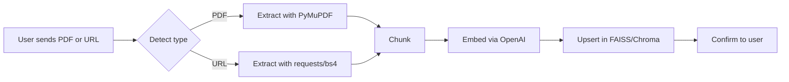

# 📌 Development Roadmap: LangChain + LlamaIndex Telegram AI Assistant (RAG-Based)

This document is **not** a README. It is a **development roadmap + implementation guide** for building a **production-ready, class-based, highly modular Telegram bot** that ingests files or URLs and provides grounded answers using Retrieval-Augmented Generation (RAG) based on **LlamaIndex or LlamaIndex**.

---

## 🎯 Project Goal

Build a Telegram bot that supports the following:

- Accepts **PDFs, URLs, or plain text** via commands.
- Extracts content → splits into chunks → generates vector embeddings.
- Stores these chunks in a **vector database** (e.g., FAISS or ChromaDB).
- When user asks a question, the bot retrieves **most relevant chunks**, builds a **context-aware prompt**, and responds using an LLM.
- Supports **Persian (fa)** and **English (en)** natively.
- Must be fully **async**, **type-hinted**, **commented**, **tested**, and **dockerized**.

---

## 🧠 Core Concepts

| Concept | Use |
|--------|-----|
| Retrieval-Augmented Generation (RAG) | Improve LLM answers by grounding in specific, private data |
| LangChain / LlamaIndex | Pipeline management and modular abstraction |
| FAISS / ChromaDB | Fast similarity search on vector embeddings |
| Aiogram | Modern async Telegram bot framework |
| Redis | Caching / session memory / rate limiting (optional) |

---

## 🏗️ Architecture Overview

### Modules

```bash
ragbot/
├── app/
│   ├── bot.py                  # bot entrypoint (aiogram setup)
│   ├── routes.py               # /ask, /add, /reset, /help handlers
│   └── middleware/auth.py      # allowlist enforcement
├── rag/
│   ├── loaders/pdf.py          # extract text from PDFs using PyMuPDF
│   ├── loaders/url.py          # fetch & sanitize content from URLs
│   ├── chunkers/split.py       # chunking logic (tokens/sentences)
│   ├── embeddings/openai.py    # embed text using OpenAI/any model
│   ├── store/faiss_store.py    # FAISS wrapper
│   ├── retrieve/retriever.py   # similarity search interface
│   ├── qa/chain.py             # build final prompt + query LLM
│   └── qa/prompting.py         # prompt templates for RAG
├── configs/settings.py         # PydanticSettings for .env config
├── outputs/logger.py           # structured logging
├── tests/                      # pytest-based test suite
├── Dockerfile
├── docker-compose.yml
├── README.md
└── README.fa.md
```

---

## ⚙️ Configuration

Use `.env` file loaded via `pydantic-settings`. Example variables:

```env
BOT_TOKEN=1234:abcde
DEFAULT_LANG=fa
VECTOR_DB=faiss
LLM_PROVIDER=openai
OPENAI_API_KEY=sk-...
EMBED_MODEL=text-embedding-ada-002
CHUNK_SIZE=512
TOP_K=4
CACHE_TTL=3600
ALLOW_USERS=12345678,87654321
```

---

## 🧵 Core Flows

### `/add` — Ingest Document



### `/ask` — Query


---

## 🔍 Function Signatures & Structure

### app/routes.py

```python
@router.message(Command("ask"))
async def ask_handler(message: Message) -> None:
    # 1. Extract text and language
    # 2. Embed question
    # 3. Retrieve context chunks
    # 4. Build prompt & call LLM
    # 5. Send reply
```

### rag/loaders/pdf.py

```python
def extract_pdf_text(file_path: str) -> str:
    """Extract raw text from a PDF using PyMuPDF."""
```

### rag/chunkers/split.py

```python
def split_text(text: str, max_tokens: int) -> List[str]:
    """Split input into token-limited chunks."""
```

### rag/store/faiss_store.py

```python
class FAISSStore:
    def __init__(self, path: str) -> None:
        ...
    def upsert(self, texts: List[str], metadata: List[dict]) -> None:
        ...
    def query(self, query_vec: List[float], top_k: int = 4) -> List[str]:
        ...
```

---

## 🧪 Testing Plan

| Module | Test Case |
|--------|-----------|
| Loaders | PDF/URL load fails gracefully, removes scripts/styles |
| Chunking | Accurate splitting, no token overflow |
| Embedding | Embeds same text consistently |
| Store | FAISS upsert/query works correctly |
| Bot | `/ask` → end-to-end returns a sensible answer |

---

## 🧰 Tech Stack

- `aiogram`: Telegram bot
- `pydantic-settings`: config
- `langchain` or `llama-index`: RAG orchestration
- `faiss-cpu` or `chromadb`: vector store
- `PyMuPDF`: PDF extraction
- `httpx`, `bs4`: URL scraping
- `python-dotenv`: env loader
- `openai`: embeddings/LLM (optional)
- `redis`: caching + rate-limiting (optional)
- `ruff`, `mypy`, `pytest`, `docker`

---

## ✅ Feature Checklist

- [ ] ✅ Class-based structure with async handlers
- [ ] ✅ Telegram Bot via `aiogram`
- [ ] ✅ Support for Persian + English
- [ ] ✅ PDF, URL & plain text ingestion
- [ ] ✅ Embedding & FAISS/Chroma integration
- [ ] ✅ Prompted RAG generation
- [ ] ✅ Docker + `.env` + logging
- [ ] ✅ Tests (unit + E2E)
- [ ] ✅ Fully importable as package

---

## 🧱 Extras You Can Add Later

- 🔧 Session memory with Redis (per user)
- 🎛️ Admin commands: `/reset`, `/purge`, `/debug`
- 📈 Metrics endpoint via `aiohttp` (`/metrics`)
- 🛡️ Middleware to limit abuse (message size, rate)
- 🧩 Plugin tools: web fetcher, calculator, wiki, etc.
- 🔌 Support offline embedding models (e.g., `Instructor`, `BGE`) or LLM via `ollama`


---

## 🧪 Testing & QA Blueprint (Comprehensive)

This section extends the roadmap with **actionable**, **copy‑pasteable** testing guidance. Use `pytest`, `pytest-asyncio`, `mypy`, `ruff`, and optional `hypothesis`.

### 🎛 Test Matrix & Coverage Targets
- **Unit tests** (loaders, chunkers, embeddings wrapper, store, retriever, prompting): **≥90% line coverage** in these modules.
- **Integration tests** (ingest → query → answer cycle, FAISS/Chroma I/O): **≥75%** coverage.
- **E2E bot tests** (aiogram handlers with fake Telegram events): smoke‑level.
- **Negative tests**: corrupted PDFs, invalid URLs, timeouts, empty docs, zero results.

### 📁 Tests Folder Layout
```
tests/
  conftest.py                  # common fixtures (tmp paths, fake configs)
  unit/
    test_pdf_loader.py
    test_url_loader.py
    test_chunk_split.py
    test_embeddings_openai.py
    test_faiss_store.py
    test_retriever.py
    test_prompting.py
  integration/
    test_ingest_and_query.py   # end-to-end RAG without Telegram
  e2e/
    test_bot_routes.py         # aiogram router smoke tests
```

### 🧩 Key Fixtures (conftest.py)
```python
import os, tempfile, shutil, pytest
from types import SimpleNamespace

@pytest.fixture
def tmp_workspace():
    d = tempfile.mkdtemp(prefix="ragtest_")
    try:
        yield d
    finally:
        shutil.rmtree(d, ignore_errors=True)

@pytest.fixture
def fake_config(tmp_workspace):
    return SimpleNamespace(
        vector_db="faiss",
        store_path=os.path.join(tmp_workspace, "index"),
        chunk_size=256,
        top_k=4,
        default_lang="fa",
    )
```

### 📄 Unit Test Examples

**PDF Loader**
```python
# tests/unit/test_pdf_loader.py
import pytest
from rag.loaders.pdf import extract_pdf_text

def test_extract_pdf_text_handles_empty_pdf(tmp_path):
    # create an empty PDF or a minimal one; loader should return ""
    p = tmp_path / "empty.pdf"
    p.write_bytes(b"%PDF-1.4\n%... minimal stub ...")
    text = extract_pdf_text(str(p))
    assert isinstance(text, str)
```

**Chunk Splitter**
```python
# tests/unit/test_chunk_split.py
from rag.chunkers.split import split_text

def test_split_text_token_bounds():
    txt = "سلام " * 1000
    chunks = split_text(txt, max_tokens=128)
    assert all(len(c) > 0 for c in chunks)
    assert len(chunks) >= 1
```

**FAISS Store (guarded import)**
```python
# tests/unit/test_faiss_store.py
import pytest

faiss = pytest.importorskip("faiss", reason="faiss-cpu not installed")
from rag.store.faiss_store import FAISSStore

def test_faiss_upsert_and_query(tmp_path):
    store = FAISSStore(path=str(tmp_path))
    texts = ["hello world", "salam donya", "bonjour le monde"]
    meta = [{"id": i} for i in range(len(texts))]
    store.upsert(texts, meta)
    hits = store.query_vec([0.0]*768, top_k=2)  # or query(text) wrapper with embeddings mocked
    assert isinstance(hits, list)
```

**Prompting**
```python
# tests/unit/test_prompting.py
from rag.qa.prompting import build_prompt

def test_build_prompt_includes_sources():
    ctx = ["Para1", "Para2"]
    q = "What is this about?"
    p = build_prompt(context=ctx, question=q, lang="en")
    assert "Sources" in p
    assert q in p
```

### 🔗 Integration: Ingest → Query (No Telegram)
```python
# tests/integration/test_ingest_and_query.py
import pytest
from rag.loaders.pdf import extract_pdf_text
from rag.chunkers.split import split_text
from rag.embeddings.openai import embed_texts
from rag.store.faiss_store import FAISSStore
from rag.retrieve.retriever import retrieve_topk
from rag.qa.chain import answer_with_context

@pytest.mark.skipif(True, reason="example; replace with real embedding mock")
def test_ingest_and_query_flow(tmp_path):
    raw = "متن تست فارسی. This is a bilingual test."
    chunks = split_text(raw, max_tokens=64)
    vecs = [[0.0]*768 for _ in chunks]  # mock embeddings
    store = FAISSStore(path=str(tmp_path))
    store.upsert(chunks, [{"idx": i} for i in range(len(chunks))])
    qvec = [0.0]*768
    ctx = retrieve_topk(store, qvec, k=3)
    ans = answer_with_context(ctx, question="چی میگه؟", lang="fa")
    assert isinstance(ans, str)
```

### 🤖 E2E (Bot Routes) — Smoke
```python
# tests/e2e/test_bot_routes.py
import pytest, asyncio
from aiogram.types import Message
from app.routes import ask_handler  # ensure handler has minimal logic and delegates to services

@pytest.mark.asyncio
async def test_ask_handler_smoke(fake_message):
    # fake_message -> fixture creating aiogram Message with .text
    await ask_handler(fake_message)  # assert no exceptions
```

### 🧪 Property-Based Testing (Optional)
Use `hypothesis` to stress splitters and normalizers:
```python
from hypothesis import given, strategies as st
from rag.chunkers.split import split_text

@given(st.text(min_size=0, max_size=5000))
def test_split_text_never_raises(s):
    split_text(s, max_tokens=128)
```

### 🧯 Negative Cases to Include
- Over‑large PDFs (enforce size & page limits)
- Malformed URLs / non‑HTML responses
- Empty result sets (return a friendly message)
- Embedding/LLM timeouts (retry/backoff or error messaging)

### 🧰 Local Test Run
```bash
pytest -q --maxfail=1 --disable-warnings
coverage run -m pytest && coverage report -m
ruff check .
mypy ragbot
```

### 🔄 CI (GitHub Actions)
`.github/workflows/ci.yml`:
```yaml
name: CI
on: [push, pull_request]
jobs:
  test:
    runs-on: ubuntu-latest
    strategy:
      matrix:
        python-version: ["3.10", "3.11", "3.12"]
    steps:
      - uses: actions/checkout@v4
      - uses: actions/setup-python@v5
        with: { python-version: ${{ matrix.python-version }} }
      - run: pip install -U pip
      - run: pip install -e .[dev]
      - run: ruff check .
      - run: mypy ragbot
      - run: pytest -q
```

### 🧷 Notes on Mocks & Determinism
- **Embedding/LLM** calls should be mocked for unit tests.
- Keep test data **small** (fast, deterministic).
- Prefer injecting dependencies (engines, stores) via constructors to simplify mocking.
