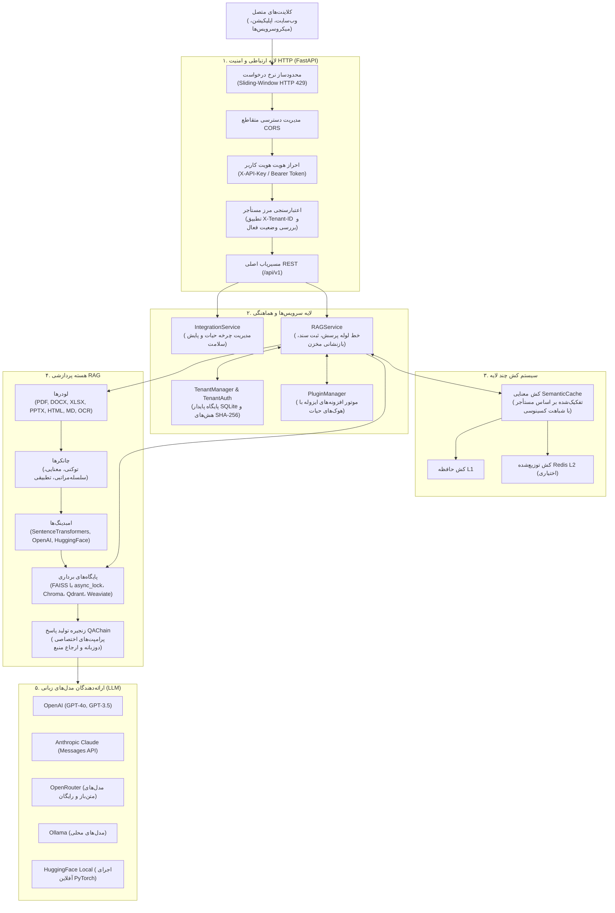

# RAGBot — پلتفرم بک‌اند سازمانی و API-محور برای RAG

[](https://github.com/dibbed/rag-telegram-assistant/actions/workflows/ci.yml)
[-success.svg)](#-تست‌ها-و-اعتبارسنجی)
[](https://www.python.org/)
[](https://fastapi.tiangolo.com/)
[](LICENSE)
[](docs/ARCHITECTURE.fa.md)

پلتفرم بک‌اند پرسرعت و بهینه‌سازی‌شده برای تولید تقویت‌شده با بازیابی اطلاعات (**Retrieval-Augmented Generation - RAG**) مبتنی بر **FastAPI REST API**. این سیستم انواع اسناد متنی (شامل PDF، Word، اکسل، پاورپوینت، HTML، مارک‌داون، متن ساده و تصاویر از طریق OCR) و نشانی‌های وب را دریافت و خردسازی کرده و با استفاده از مدل‌های زبانی بزرگ، پاسخ‌هایی دقیق به همراه ارجاع مستند به منابع و شاخص اعتماد ارائه می‌دهد.

دارای پشتیبانی بومی از زبان‌های فارسی و انگلیسی، معماری چندمستأجری (Multi-Tenant) سخت‌گیرانه با احراز هویت کلیدهای رمزنگاری‌شده بر پایه هش SHA-256 در SQLite، زیرسیستم افزونه‌های درون‌پردازشی با تفکیک خطاها، کش چندسطحی معنایی (Semantic Cache)، پایگاه‌های برداری ایمن در برابر دسترسی همزمان (FAISS با `async_lock`، Chroma، Qdrant و Weaviate)، کنترل نرخ درخواست لغزان و اتصال به ارائه‌دهندگان مطرح LLM (OpenAI، Anthropic Claude، OpenRouter، Ollama و HuggingFace).

> [!NOTE]
> **English Documentation**: Full English documentation is available in [README.md](README.md).

---

## 🏛️ معماری کلان سیستم



---

## ✨ ویژگی‌های برجسته فنی

| قابلیت | جزئیات پیاده‌سازی |
|:---|:---|
| **معماری API-محور** | پیاده‌سازی با FastAPI نسخه ۰.۱۱۵+، مستندات خودکار Swagger UI و ReDoc، اعتبارسنجی دقیق داده‌ها با Pydantic و مدیریت چرخه حیات با Lifespan. |
| **ایزولاسیون چندمستأجری** | تفکیک کامل هویت از مسیریابی. جداسازی کامل مخازن برداری، کش معنایی و سهمیه‌های مصرفی به ازای هر مستأجر همراه با پایگاه داده پایدار SQLite (`tenants.db`). |
| **احراز هویت رمزنگاری‌شده** | کلیدهای API خام با قالب `rgb_<token>` تنها یک‌بار در هنگام ایجاد نمایش داده می‌شوند. در پایگاه داده تنها هش‌های رمزنگاری‌شده SHA-256 ذخیره می‌گردد. قابلیت لغو فوری کلیدها بدون نیاز به راه‌اندازی مجدد سرور. |
| **معماری افزونه‌های ایزوله** | امکان توسعه سیستم بدون تغییر در هسته اصلی با پشتیبانی از هوک‌های پردازش سند، پرسش و پاسخ. خطاهای احتمالی افزونه‌ها کاملاً ایزوله بوده و اختلالی در عملکرد سرور ایجاد نمی‌کند. |
| **همزمانی ایمن پایگاه‌های برداری** | مخزن پیش‌فرض FAISS مجهز به قفل سطح کلاس `async_lock` است که از بروز مسابقه داده‌ها (Race Condition) و خطای قفل فایل در ویندوز (`WinError 32`) جلوگیری می‌کند. پشتیبانی کامل از Chroma، Qdrant و Weaviate. |
| **کش چندسطحی معنایی** | پاسخ‌دهی زیر ۵۰ میلی‌ثانیه به پرسش‌های مشابه بر اساس شباهت کسینوسی امبدینگ‌ها (`آستانه >= ۰.۸۵`). تفکیک کامل کش‌ها بر اساس شناسه مستأجر برای جلوگیری از نشت داده. |
| **پشتیبانی کامل دوزبانه (فارسی و انگلیسی)** | تنظیم اختصاصی قالب‌های پرامپت، رتبه‌بندی نتایج و بازگرداندن پاسخ نهایی به همراه استناد شفاف به اسناد و درصد اعتماد به پاسخ. |
| **ابزار خط فرمان جامع (`ragbot-cli`)** | ابزار ترمینال برای مدیریت مستأجرها، صدور و لغو کلیدهای API، مدیریت افزونه‌ها، مهاجرت و بنچمارک مخازن برداری و تحلیل استفاده. |

---

## 🚀 شروع سریع

### ۱. پیش‌نیازها و راه‌اندازی محیط

ابتدا مطمئن شوید پایتون نسخه ۳.۱۰، ۳.۱۱ یا ۳.۱۲ روی سیستم نصب است:

```bash
# کلون مخزن گیت
git clone https://github.com/dibbed/rag-telegram-assistant.git
cd rag-telegram-assistant

# ایجاد و فعال‌سازی محیط مجازی
# در ویندوز (PowerShell):
python -m venv venv
.\venv\Scripts\Activate.ps1

# در لینوکس یا مک:
python3 -m venv venv
source venv/bin/activate

# ارتقای pip و نصب وابستگی‌ها
pip install -U pip
pip install -r requirements.txt
```

### ۲. تنظیم متغیرهای محیطی

فایل نمونه متغیرهای محیطی را کپی کرده و در صورت تمایل شخصی‌سازی کنید:

```bash
cp env.example .env
```

نمونه تنظیمات حداقلی برای تست محلی کاملاً رایگان:
```env
# تنظیمات سرور
HOST=0.0.0.0
PORT=8000

# ارائه‌دهنده مدل زبانی (openrouter, openai, anthropic, ollama, hf_local)
LLM_PROVIDER=openrouter
LLM_MODEL=x-ai/grok-4-fast:free
OPENROUTER_API_KEY=کلید_شما_در_openrouter

# امبدینگ (Sentence Transformers روی پردازنده مرکزی CPU به صورت آفلاین اجرا می‌شود)
EMBED_PROVIDER=sentence_transformers
EMBED_MODEL=intfloat/e5-small-v2

# مخزن برداری پیش‌فرض (faiss, chroma, qdrant, weaviate)
VECTOR_STORE_DEFAULT_STORE=faiss
```

### ۳. اجرای سرور API

```bash
# از طریق فایل اصلی پروژه:
python main.py

# یا مستقیماً از طریق Uvicorn:
uvicorn ragbot.api.app:app --host 0.0.0.0 --port 8000 --reload
```

مستندات تعاملی API بلافاصله در آدرس‌های زیر در دسترس است:
- **Swagger UI**: [http://localhost:8000/docs](http://localhost:8000/docs)
- **ReDoc**: [http://localhost:8000/redoc](http://localhost:8000/redoc)
- **OpenAPI Schema**: [http://localhost:8000/openapi.json](http://localhost:8000/openapi.json)

---

## 📡 مسیرهای اصلی REST API

| متد | مسیر | توضیحات | احراز هویت (در حالت چندمستأجری) |
|:---|:---|:---|:---|
| `GET` | `/health` / `/api/v1/health` | بررسی بلادرنگ سلامت تمام اجزا و زیرسیستم‌ها | بدون نیاز |
| `POST` | `/api/v1/query` | پرسش و پاسخ متنی به همراه استناد به منابع و امتیاز اعتماد | الزامی (`X-API-Key` یا Bearer) |
| `POST` | `/api/v1/documents/upload` | بارگذاری و ایندکس فایل‌های سندی (PDF, Word, Excel, PPTX و ...) | الزامی (`X-API-Key` یا Bearer) |
| `POST` | `/api/v1/documents/text` | ذخیره مستقیم متن خام در پایگاه دانش | الزامی (`X-API-Key` یا Bearer) |
| `POST` | `/api/v1/documents/url` | استخراج و ایندکس محتوای یک صفحه وب از طریق لینک | الزامی (`X-API-Key` یا Bearer) |
| `POST` | `/api/v1/documents/reset` | پاک‌سازی اسناد مخزن برداری و نامعتبرسازی کش‌های معنایی | الزامی (سطح دسترسی مدیر) |

---

### نمونه‌های فراخوانی API

#### ۱. پرسش از پایگاه دانش به زبان فارسی

```bash
curl -X POST "http://localhost:8000/api/v1/query" \
  -H "Content-Type: application/json" \
  -d '{
    "question": "انواع روش‌های خردسازی اسناد (Chunking) در سیستم چیست؟",
    "language": "fa",
    "top_k": 3,
    "similarity_threshold": 0.6
  }'
```

**پاسخ نمونه:**
```json
{
  "answer": "سیستم RAGBot از چهار راهبرد خردسازی توکنی، معنایی، سلسله‌مراتبی و تطبیقی پشتیبانی می‌کند...",
  "sources": ["architecture_overview.pdf (صفحه ۴)"],
  "confidence_score": 0.94,
  "processing_time": 0.42,
  "language": "fa",
  "retrieved_chunks": 3,
  "metadata": {}
}
```

#### ۲. پرسش در حالت چندمستأجری با کلید API

```bash
curl -X POST "http://localhost:8000/api/v1/query" \
  -H "Content-Type: application/json" \
  -H "X-API-Key: rgb_abcdef1234567890abcdef1234567890" \
  -H "X-Tenant-ID: acme_corp" \
  -d '{
    "question": "قوانین کاری دورکاری در شرکت چیست؟",
    "language": "fa"
  }'
```

#### ۳. ذخیره متن خام در پایگاه دانش

```bash
curl -X POST "http://localhost:8000/api/v1/documents/text" \
  -H "Content-Type: application/json" \
  -d '{
    "text": "کارمندان می‌توانند با موافقت مدیر تیم تا سقف ۳ روز در هفته دورکاری کنند.",
    "title": "سیاست_دورکاری",
    "metadata": {"واحد": "منابع انسانی", "سال": 1404}
  }'
```

---

## 🛠️ راهنمای ابزار خط فرمان (`ragbot-cli`)

سیستم دارای یک واسط خط فرمان قدرتمند برای امور مدیریتی و عملیاتی است:

```bash
# راهنمای کلی دستورات
python -m ragbot.cli --help

# مدیریت مستأجرها (Multi-Tenant)
python -m ragbot.cli tenant create --name "شرکت نمونه" --tier premium --plan monthly
python -m ragbot.cli tenant info --tenant-id <شناسه_مستأجر>
python -m ragbot.cli tenant create-api-key --tenant-id <شناسه_مستأجر> --name "کلید_تولید"
python -m ragbot.cli tenant list-api-keys --tenant-id <شناسه_مستأجر>
python -m ragbot.cli tenant revoke-api-key --tenant-id <شناسه_مستأجر> --key-id <شناسه_کلید>

# مدیریت افزونه‌ها (Plugins)
python -m ragbot.cli plugin list
python -m ragbot.cli plugin load --path plugins/custom_plugin.py
python -m ragbot.cli plugin reload --plugin-id custom_plugin
python -m ragbot.cli plugin unload --plugin-id custom_plugin

# بنچمارک و مهاجرت مخازن برداری
python -m ragbot.cli benchmark-stores --stores faiss chroma
python -m ragbot.cli migrate-store --source faiss --target qdrant
```

---

## 🛡️ معماری امنیت و کنترل دسترسی

- **تفکیک کامل هویت از مسیریابی**: هویت کلاینت‌ها ابتدا از طریق هدر `X-API-Key` یا توکن Bearer اعتبارسنجی می‌شود. تلاش برای دسترسی به مستأجر دیگر از طریق هدر `X-Tenant-ID` بلافاصله با خطای `HTTP 403 Forbidden` مسدود می‌گردد. در صورت عدم ارسال کلید، خطای `HTTP 401 Unauthorized` صادر می‌شود.
- **عدم ذخیره متن کلیدها**: کلیدهای خام با پیشوند `rgb_...` ساخته شده و تنها در لحظه ساخت نمایش داده می‌شوند. در پایگاه SQLite تنها هش امن SHA-256 ذخیره می‌گردد.
- **محافظت از عملیات بازنشانی**: پاک‌سازی مخزن برداری در مسیر `/api/v1/documents/reset` فقط توسط کاربران دارای نقش مدیر (`admin` یا `super_admin`) مجاز است.
- **کنترل نرخ درخواست (Rate Limiting)**: کنترل لغزان بر پایه زمان به ازای هر IP با ظرفیت پیش‌فرض ۶۰ درخواست در دقیقه (`SECURITY_RATE_LIMIT_REQUESTS=60`). عبور از حد مجاز با خطای استاندار `HTTP 429 Too Many Requests` پاسخ داده می‌شود.
- **اعتبارسنجی مسیر و حجم فایل**: جلوگیری خودکار از حملات Path Traversal و محدودسازی حجم اسناد آپلودی (پیش‌فرض ۵۰ مگابایت با خطای `HTTP 413`).

---

## 🧪 تست‌ها و اعتبارسنجی

اجرای تست‌های خودکار برای جلوگیری از تداخل حافظه کارت گرافیک، به صورت **اجباری روی پردازنده مرکزی (CPU)** انجام می‌شود:

### ویندوز (PowerShell):
```powershell
$env:CUDA_VISIBLE_DEVICES = ""
$env:TORCH_DEVICE = "cpu"
.\venv\Scripts\pytest.exe -o addopts='' -q
```

### لینوکس / مک:
```bash
export CUDA_VISIBLE_DEVICES=""
export TORCH_DEVICE="cpu"
pytest -o addopts='' -q
```

**وضعیت آخرین اجرای آزمون‌ها:**
```text
627 passed, 1 skipped, 6 warnings in 110.00s (نرخ موفقیت ۱۰۰٪)
```

برای مشاهده ساختار و جزئیات تست‌ها به فایل [docs/testing.md](docs/testing.md) مراجعه نمایید.

---

## 🐳 استقرار با داکر (Docker)

اجرای کامل سیستم با استفاده از Docker Compose:

```bash
docker compose up --build -d
```

دایرکتوری‌های `./data`، `./logs` و `./cache` برای حفظ داده‌ها و کارکرد آفلاین روی سیستم میزبان مونت می‌شوند. برای تنظیمات Nginx و سرورهای توزیع‌شده به [docs/DEPLOYMENT.md](docs/DEPLOYMENT.md) مراجعه فرمایید.

---

## 📚 فهرست مستندات

- 📖 [راهنمای جامع معماری](docs/ARCHITECTURE.md) (و [نسخه فارسی](docs/ARCHITECTURE.fa.md))
- 📡 [مستندات کامل REST API](docs/API.md)
- ⚙️ [راهنمای متغیرهای محیطی و تنظیمات](docs/configuration.md)
- 🚀 [راهنمای استقرار در محیط عملیاتی](docs/DEPLOYMENT.md)
- 🧪 [راهنمای آزمون‌ها و تست‌های خودکار](docs/testing.md)
- 🗄️ [راهنمای پایگاه‌های داده برداری](docs/VECTOR_STORES.md)
- 📚 [پشتیبانی از فرمت‌های مختلف اسناد](docs/MULTI_FORMAT_SUPPORT.md)
- 💡 [مثال‌ها و کدهای نمونه](docs/EXAMPLES.md)
- ❓ [پرسش‌های متداول (FAQ)](docs/FAQ.md)
- 📜 [گزارش تغییرات (Changelog)](CHANGELOG.md)

---

## 📄 مجوز

مجوز MIT © 2025–2026 [dibbed](https://github.com/dibbed).
