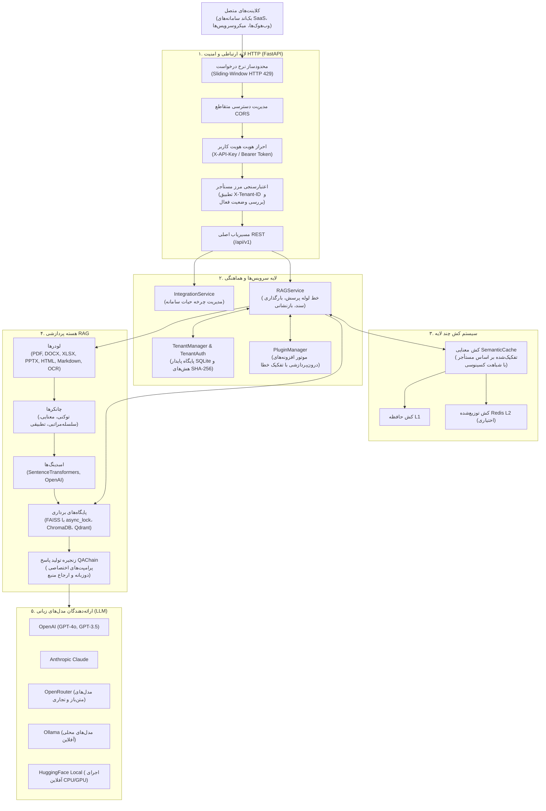

# TenantRAG — زیرساخت RAG چندمستأجری برای بک‌اند سامانه‌های SaaS

**میکروسرویس RAG چندمستأجری مبتنی بر FastAPI برای توسعه‌دهندگان سامانه‌های ابری و سازمانی.**

[](https://github.com/dibbed/tenant-rag/actions/workflows/ci.yml)
[](#-تست‌ها-و-اعتبارسنجی)
[](https://www.python.org/)
[](https://fastapi.tiangolo.com/)
[](LICENSE)

پروژه **TenantRAG** یک میکروسرویس مستقل و API-محور به زبان پایتون است که امکان پیاده‌سازی تولید تقویت‌شده با بازیابی اطلاعات (**RAG**) را با تمرکز ویژه بر **جداسازی داده‌های چندمستأجری (Multi-Tenancy)** فراهم می‌سازد. در این سامانه، مخازن برداری هر سازمان در دایرکتوری‌های مجزا ذخیره شده، کش معنایی به شناسه مستأجر مقید است و احراز هویت با کلیدهای API بر پایه هش SHA-256 انجام می‌پذیرد.

> [!NOTE]
> **English Documentation**: مستندات انگلیسی به همراه جزئیات معماری در فایل [README.md](README.md) در دسترس است.

---

## ⚡ راه‌اندازی سریع در ۶۰ ثانیه

### ۱. نصب و آماده‌سازی محیط

```bash
# دریافت مخزن
git clone https://github.com/dibbed/tenant-rag.git
cd tenant-rag

# ایجاد و فعال‌سازی محیط مجازی
python -m venv venv
# در ویندوز (PowerShell):
.\venv\Scripts\Activate.ps1
# در لینوکس / مکینتاش:
source venv/bin/activate

# نصب وابستگی‌ها
pip install -r requirements.txt
pip install -e .

# تنظیم فایل متغیرهای محیطی
cp env.example .env
# نکته: مقدار MULTI_TENANT_ENABLED=true در .env جداسازی داده‌ها و احراز هویت کلیدهای API را فعال می‌کند.
# در صورت غیرفعال بودن، سیستم در حالت تک‌مستأجره توسعه محلی بدون نیاز به احراز هویت اجرا خواهد شد.
```

### ۲. اجرای سرور API

```bash
python main.py
# سرور بر روی پورت 8000 اجرا می‌شود: http://localhost:8000
# مستندات تعاملی Swagger: http://localhost:8000/docs
```

### ۳. ایجاد مستأجر و کلید API (از طریق CLI)

```bash
# ایجاد مستأجر جدید
tenantrag tenant create --tenant-id acme_corp --name "Acme Corporation"

# صدور کلید دسترسی امن (کلید فقط یک‌بار نمایش داده می‌شود)
tenantrag tenant create-key --tenant-id acme_corp --name "backend_api"
# نمونه خروجی: Key created: rgb_9f8a2b3c4d5e6f708192a3b4c5d6e7f8
```

### ۴. بارگذاری و ایندکس سند (cURL)

```bash
curl -X POST "http://localhost:8000/api/v1/documents/text" \
  -H "X-Tenant-ID: acme_corp" \
  -H "X-API-Key: rgb_9f8a2b3c4d5e6f708192a3b4c5d6e7f8" \
  -H "Content-Type: application/json" \
  -d '{
    "text": "کارکنان شرکت مجاز هستند سالانه تا سقف ۵۰۰ دلار بابت تجهیزات دورکاری هزینه دریافت کنند.",
    "title": "expense_policy_2026"
  }'
```

### ۵. پرسش و دریافت پاسخ با ارجاع مستند (cURL)

```bash
curl -X POST "http://localhost:8000/api/v1/query" \
  -H "X-Tenant-ID: acme_corp" \
  -H "X-API-Key: rgb_9f8a2b3c4d5e6f708192a3b4c5d6e7f8" \
  -H "Content-Type: application/json" \
  -d '{
    "question": "سقف بودجه سالانه تجهیزات دورکاری چقدر است؟",
    "language": "fa"
  }'
```

**نمونه پاسخ سرور:**
```json
{
  "answer": "بر اساس خط‌مشی ثبت‌شده، کارکنان مجاز به دریافت سالانه تا سقف ۵۰۰ دلار جهت تجهیزات دورکاری هستند.",
  "sources": ["expense_policy_2026"],
  "confidence_score": 0.95,
  "processing_time": 0.38,
  "language": "fa"
}
```

---

## 🏢 معماری جداسازی داده‌ها در مدل چندمستأجری

برخلاف سامانه‌هایی که داده‌های کاربران مختلف را در یک کالکشن مشترک تنها با متادیتا فیلتر می‌کنند، TenantRAG از **تفکیک فیزیکی دایرکتوری‌ها** استفاده می‌کند:

```
درخواست کلاینت (X-Tenant-ID: acme_corp, X-API-Key: rgb_...)
       │
       ▼
┌────────────────────────────────────────────────────────┐
│ لایه FastAPI (احراز هویت و بررسی مرز دسترسی مستأجر)   │
└───────────────────────────┬────────────────────────────┘
                            │
              ┌─────────────┴─────────────┐
              ▼                           ▼
    ┌──────────────────┐        ┌──────────────────┐
    │ Tenant A: Acme   │        │ Tenant B: Beta   │
    ├──────────────────┤        ├──────────────────┤
    │ • کش اختصاصی     │        │ • کش اختصاصی     │
    │ • مخزن FAISS A   │        │ • مخزن FAISS B   │
    │   data/vector_   │        │   data/vector_   │
    │   stores/acme/   │        │   stores/beta/   │
    └──────────────────┘        └──────────────────┘
```

- **تفکیک در سطح سیستم فایل:** فایل‌های ایندکس هر مستأجر در پوشه مجزا (`data/vector_stores/<tenant_id>/`) ذخیره می‌شوند. مستأجر A به هیچ عنوان امکان جستجو یا ویرایش ایندکس‌های مستأجر B را ندارد.
- **کش معنایی مقید به مستأجر:** ورودی‌های کش حاوی `tenant_id` بوده و محاسبات شباهت کسینوسی منحصراً در محدوده داده‌های همان مستأجر انجام می‌گیرد.
- **جداسازی مسیر از هویت:** هویت کاربر (`X-API-Key`) مستقل از هدر مسیر (`X-Tenant-ID`) سنجیده می‌شود. تلاش برای دسترسی به مستأجر دیگر با خطای `HTTP 403 Forbidden` مسدود می‌گردد.
- *توضیح فنی:* جداسازی بر پایه پارتیشن‌بندی دایرکتوری‌ها و تفکیک پرس‌وجوهاست؛ فایل‌های روی دیسک رمزنگاری شده نیستند. برای اطلاعات تکمیلی به [SECURITY.md](SECURITY.md) مراجعه کنید.

---

## 🏛️ دیاگرام معماری سیستم



---

## ✨ قابلیت‌های تأییدشده سامانه

1. **طراحی بومی برای چندمستأجری:** ذخیره‌سازی مشخصات مستأجران، سهمیه‌ها و کلیدها در SQLite پایدار با قابلیت WAL. جداسازی کامل مخازن برداری و کش به ازای هر مستأجر.
2. **معماری مستقل و Headless:** ارائه به عنوان یک میکروسرویس REST API سبک بدون تحمیل رابط کاربری سنگین؛ ایده‌آل برای یکپارچه‌سازی با سامانه‌های موجود.
3. **کش معنایی مقید به مستأجر:** بازاستفاده از پاسخ‌های پرسش‌های مشابه معنایی از طریق محاسبه شباهت کسینوسی در محدوده داده‌های همان مستأجر.
4. **پشتیبانی از پایگاه‌های برداری استاندارد:** اتصال به مخازن **FAISS** (همراه با قفل‌های غیرهمزمان برای رفع تداخل فایل‌ها)، **ChromaDB** و **Qdrant**.
5. **اتصال به مدل‌های متنوع LLM:** امکان کار با **OpenAI**، **Anthropic Claude**، **OpenRouter**، **Ollama** (مدل‌های محلی آفلاین) و **HuggingFace Local**.
6. **احراز هویت با هش SHA-256:** کلیدهای دسترسی به صورت هش‌شده ذخیره شده و اعتبارسنجی با مقایسه زمان‌ثابت (`secrets.compare_digest`) صورت می‌گیرد.
7. **ایمن‌سازی همزمانی در سرور منفرد:** استفاده از `asyncio.Lock` در سطح کلاس برای جلوگیری از خطاهای قفل‌شدگی فایل در ویندوز هنگام خواندن و نوشتن همزمان ایندکس‌ها.
8. **افزونه‌های درون‌پردازشی با ایزولاسیون خطا:** امکان اجرای هوک‌های مختلف پردازشی بدون اینکه خطای یک افزونه موجب قطعی درخواست کلاینت شود.
9. **پشتیبانی دوزبانه انگلیسی و فارسی:** شناسایی علائم نگارشی فارسی (`؟`، `؛`، `،`) در تقطیع متن، تبدیل ارقام فارسی، تنظیم پیش‌فرض OCR به `fas+eng` و الگوهای پرامپت بومی‌سازی‌شده.
10. **واسط خط فرمان (`tenantrag`):** ابزار CLI کاربردی جهت مدیریت مستأجران، صدور و لغو کلیدها، مهاجرت مخازن و ارزیابی عملکرد.

---

## 📡 مرجع مسیرهای API

| متد | مسیر (Endpoint) | شرح عملکرد | نیاز به احراز هویت |
|:---|:---|:---|:---|
| `GET` | `/health` / `/api/v1/health` | بررسی سلامت سرویس و وضعیت اجزا | خیر |
| `POST` | `/api/v1/query` | پرسش از اسناد با ارجاع منبع و شاخص اعتماد | بله (`X-API-Key`, `X-Tenant-ID`) |
| `POST` | `/api/v1/documents/text` | ثبت متن خام در ایندکس مستأجر | بله (`X-API-Key`, `X-Tenant-ID`) |
| `POST` | `/api/v1/documents/upload` | بارگذاری فایل سند (PDF, DOCX, XLSX و ...) | بله (`X-API-Key`, `X-Tenant-ID`) |
| `POST` | `/api/v1/documents/url` | استخراج و ایندکس محتوا از نشانی وب | بله (`X-API-Key`, `X-Tenant-ID`) |
| `POST` | `/api/v1/documents/reset` | پاک‌سازی ایندکس‌ها و کش مستأجر | بله (نقش ادمین) |

---

## 🛠️ راهنمای ابزار خط فرمان (CLI)

دستور `tenantrag` (دارای نام مستعار `ragbot-cli` برای حفظ سازگاری گذشته):

```bash
# راهنمای کلی دستورات
tenantrag --help

# ایجاد مستأجر جدید
tenantrag tenant create --tenant-id org_alpha --name "Alpha Organization"

# صدور کلید دسترسی
tenantrag tenant create-key --tenant-id org_alpha --name "production_key"

# مشاهده کلیدهای فعال
tenantrag tenant list-keys --tenant-id org_alpha

# لغو کلید دسترسی
tenantrag tenant revoke-key --tenant-id org_alpha --key-id <key_id>

# ایندکس فایل محلی با مشخص کردن مستأجر
tenantrag ingest --file handbook.pdf --tenant-id org_alpha

# پرسش از مستأجر با CLI
tenantrag query --question "مفاد سیاست چیست؟" --tenant-id org_alpha
```

---

## 📊 بنچمارک‌های تجدیدپذیر

اسکریپت‌های سنجش عملکرد در پوشه `benchmarks/` قرار دارند تا بتوانید کارایی واقعی سامانه را بر روی سخت‌افزار خود اندازه‌گیری کنید:

```bash
# سنجش زمان پاسخ کش معنایی (Hit در برابر Miss)
python benchmarks/bench_cache.py --iterations 50

# پروفایل ردپای حافظه رم پردازه (RSS)
python benchmarks/bench_memory.py --chunks 1000

# آزمایش همزمانی درخواست‌ها روی مستأجران مختلف
python benchmarks/bench_concurrency.py --concurrency 10 --tenants 3 --ops 10

# سنجش سرعت ایندکس اسناد در پایگاه برداری
python benchmarks/bench_ingest.py --backend faiss --chunks 500
```

---

## 🧪 تست‌ها و اعتبارسنجی

مجموعه تست‌های خودکار در محیط ایزوله پردازنده (CPU Isolation) اجرا می‌شوند:

```powershell
# اجرای تست‌ها در ویندوز (PowerShell):
$env:CUDA_VISIBLE_DEVICES = ""
$env:TORCH_DEVICE = "cpu"
pytest -q
```

**وضعیت تأییدشده تست‌ها:**
```text
627 passed, 1 skipped, 0 failed in CPU isolation
```

---

## 🐳 راه‌اندازی با داکر (Docker)

پیکربندی کانتینر در فایل‌های `Dockerfile` و `docker-compose.yml` آماده استفاده است:

```bash
# ساخت و اجرای کانتینر روی پورت 8000
docker compose up --build -d

# بررسی سلامت سرویس
curl http://localhost:8000/api/v1/health
```

---

## 📚 فهرست مستندات

- 🛡️ [سند امنیت و مرزبندی مستأجران](SECURITY.md)
- 🤝 [راهنمای مشارکت در پروژه](CONTRIBUTING.md)
- 📖 [راهنمای جامع معماری](docs/ARCHITECTURE.md)
- 📡 [مشخصات کامل REST API](docs/API.md)
- ⚙️ [تنظیمات و پیکربندی](docs/configuration.md)
- 🚀 [راهنمای استقرار در سرور](docs/DEPLOYMENT.md)
- 🗄️ [پایگاه‌های برداری](docs/VECTOR_STORES.md)
- 📚 [پشتیبانی از فرمت‌های اسناد](docs/MULTI_FORMAT_SUPPORT.md)
- 💡 [نمونه‌های کاربردی](docs/EXAMPLES.md)
- ❓ [پرسش‌های متداول (FAQ)](docs/FAQ.md)
- 📜 [تاریخچه تغییرات](CHANGELOG.md)

---

## 📄 مجوز (License)

مجوز MIT © 2025–2026 تیم توسعه TenantRAG.
