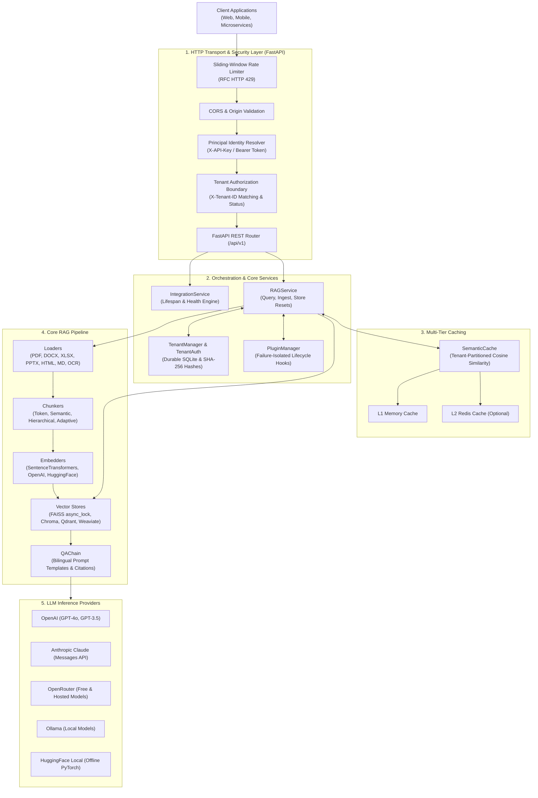

# RAGBot — Production-Ready API-First RAG Backend

[](https://github.com/dibbed/rag-telegram-assistant/actions/workflows/ci.yml)
[](#-testing--verification)
[](https://www.python.org/)
[](https://fastapi.tiangolo.com/)
[](LICENSE)
[](docs/ARCHITECTURE.md#-multi-tenant-subsystem)

High-performance, production-ready Python backend providing an **API-first Retrieval-Augmented Generation (RAG)** platform over documents (PDF, DOCX, TXT, HTML, Markdown, PPTX, XLSX, images via OCR) and web URLs. 

Features native multilingual capabilities (English and Persian), hardened multi-tenant isolation with cryptographic SHA-256 API key authentication, failure-isolated in-process plugins, multi-tier semantic caching, concurrency-safe vector stores (FAISS with class-level `async_lock`, Chroma, Qdrant, Weaviate), sliding-window rate limiting, and broad LLM support (OpenAI, Anthropic Claude, OpenRouter, Ollama, HuggingFace).

> [!NOTE]
> **مستندات فارسی**: مستندات کامل به زبان فارسی در فایل [README.fa.md](README.fa.md) در دسترس است.

---

## 🏛️ System Architecture



---

## ✨ Key Capabilities

| Capability | Technical Details |
|:---|:---|
| **API-First Architecture** | Clean REST API built on FastAPI 0.115+ with interactive Swagger UI, ReDoc, automated Pydantic schema validation, and single-instance Lifespan management. |
| **Enterprise Multi-Tenancy** | Zero-trust identity and routing separation. Data, vector index partitions, and semantic caches strictly segregated per tenant. Durable SQLite persistence (`tenants.db`). |
| **Cryptographic Authentication** | Raw keys formatted as `rgb_<token>` shown only once upon creation. Only SHA-256 hashes stored in SQLite with compound indexes. Immediate revocation and prefix masking (`rgb_...`). |
| **Failure-Isolated Plugins** | Trusted in-process plugin architecture with standard lifecycle hooks (`PRE/POST_DOCUMENT_INGEST`, `PRE/POST_QUERY`, `PRE/POST_RESPONSE`). Exceptions in plugins never disrupt host requests. |
| **Concurrency-Safe Vector Stores** | `FAISSVectorStore` protected by class-level `async_lock`, preventing race conditions and Windows file collisions (`[WinError 32]`). First-class support for Chroma, Qdrant, and Weaviate. |
| **Multi-Tier Semantic Caching** | Sub-50ms query response reuse by computing embedding cosine similarity (`>= 0.85 threshold`). Tenant-isolated cache keys preventing cross-tenant information leakage. |
| **Native Multilingual (FA / EN)** | Grounded prompt templates and tokenization tuned for Persian (`fa`) and English (`en`), returning answer text, source document citations, and confidence scores. |
| **Comprehensive CLI** | `ragbot-cli` for automated operations: tenant provisioning, API key issuance/revocation, plugin management, store migration, benchmarking, and analytics. |

---

## 🚀 Quick Start

### 1. Prerequisites & Environment Setup

Ensure Python 3.10, 3.11, or 3.12 is installed:

```bash
# Clone the repository
git clone https://github.com/dibbed/rag-telegram-assistant.git
cd rag-telegram-assistant

# Create and activate virtual environment
# Windows (PowerShell):
python -m venv venv
.\venv\Scripts\Activate.ps1

# Linux / macOS:
python3 -m venv venv
source venv/bin/activate

# Upgrade pip and install dependencies
pip install -U pip
pip install -r requirements.txt
```

### 2. Configuration

Copy the example configuration to `.env`:

```bash
cp env.example .env
```

Minimal configuration for free local testing:
```env
# Server
HOST=0.0.0.0
PORT=8000

# LLM Provider (options: openrouter, openai, anthropic, ollama, hf_local)
LLM_PROVIDER=openrouter
LLM_MODEL=x-ai/grok-4-fast:free
OPENROUTER_API_KEY=your_openrouter_key_here

# Embeddings (Sentence Transformers runs offline on CPU)
EMBED_PROVIDER=sentence_transformers
EMBED_MODEL=intfloat/e5-small-v2

# Vector Store (faiss, chroma, qdrant, weaviate)
VECTOR_STORE_DEFAULT_STORE=faiss
```

### 3. Start the Server

```bash
# Via Python entry point:
python main.py

# Or via Uvicorn directly:
uvicorn ragbot.api.app:app --host 0.0.0.0 --port 8000 --reload
```

Interactive documentation is immediately available at:
- **Swagger UI**: [http://localhost:8000/docs](http://localhost:8000/docs)
- **ReDoc**: [http://localhost:8000/redoc](http://localhost:8000/redoc)
- **OpenAPI Schema**: [http://localhost:8000/openapi.json](http://localhost:8000/openapi.json)

---

## 📡 REST API Reference

### Core Endpoints

| Method | Endpoint | Description | Auth Required (Multi-Tenant) |
|:---|:---|:---|:---|
| `GET` | `/health` / `/api/v1/health` | Subsystem operational status and health metrics | No |
| `POST` | `/api/v1/query` | Ask questions with grounded citations and confidence scores | Yes (`X-API-Key` or Bearer) |
| `POST` | `/api/v1/documents/upload` | Upload and ingest document files (PDF, Word, Excel, PPTX, etc.) | Yes (`X-API-Key` or Bearer) |
| `POST` | `/api/v1/documents/text` | Ingest raw text directly into the knowledge base | Yes (`X-API-Key` or Bearer) |
| `POST` | `/api/v1/documents/url` | Ingest web page content from a remote URL | Yes (`X-API-Key` or Bearer) |
| `POST` | `/api/v1/documents/reset` | Clear stored vectors and invalidate semantic cache entries | Yes (Admin Role Required) |

---

### API Usage Examples

#### 1. RAG Query (Single-Tenant Mode)

```bash
curl -X POST "http://localhost:8000/api/v1/query" \
  -H "Content-Type: application/json" \
  -d '{
    "question": "What chunking strategies are supported by the system?",
    "language": "en",
    "top_k": 4,
    "similarity_threshold": 0.6
  }'
```

**Response:**
```json
{
  "answer": "RAGBot supports token, semantic, hierarchical, and adaptive chunking strategies...",
  "sources": ["architecture_overview.pdf (Page 4)"],
  "confidence_score": 0.94,
  "processing_time": 0.42,
  "language": "en",
  "retrieved_chunks": 4,
  "metadata": {}
}
```

#### 2. Multi-Tenant Query with API Key Authentication

```bash
curl -X POST "http://localhost:8000/api/v1/query" \
  -H "Content-Type: application/json" \
  -H "X-API-Key: rgb_abcdef1234567890abcdef1234567890" \
  -H "X-Tenant-ID: acme_corp" \
  -d '{
    "question": "What is our internal leave policy?",
    "language": "en"
  }'
```

#### 3. Ingesting Plain Text into Knowledge Base

```bash
curl -X POST "http://localhost:8000/api/v1/documents/text" \
  -H "Content-Type: application/json" \
  -d '{
    "text": "Employees may work remotely up to 3 days per week with team manager approval.",
    "title": "remote_work_policy",
    "metadata": {"department": "HR", "effective_year": 2026}
  }'
```

#### 4. Resetting the Knowledge Base (Requires Admin Role in Multi-Tenant Mode)

```bash
curl -X POST "http://localhost:8000/api/v1/documents/reset" \
  -H "X-API-Key: rgb_admin_token_here" \
  -H "X-Tenant-ID: acme_corp"
```

---

## 🛠️ CLI Operations Guide (`ragbot-cli`)

RAGBot includes a command-line interface for administrative and maintenance tasks:

```bash
# General help
python -m ragbot.cli --help

# Multi-Tenant Management
python -m ragbot.cli tenant create --name "Acme Corp" --tier premium --plan monthly
python -m ragbot.cli tenant info --tenant-id <tenant_id>
python -m ragbot.cli tenant create-api-key --tenant-id <tenant_id> --name "production_key"
python -m ragbot.cli tenant list-api-keys --tenant-id <tenant_id>
python -m ragbot.cli tenant revoke-api-key --tenant-id <tenant_id> --key-id <key_id>

# Plugin Management
python -m ragbot.cli plugin list
python -m ragbot.cli plugin load --path plugins/custom_plugin.py
python -m ragbot.cli plugin reload --plugin-id custom_plugin
python -m ragbot.cli plugin unload --plugin-id custom_plugin

# Vector Store Benchmarking & Migration
python -m ragbot.cli benchmark-stores --stores faiss chroma
python -m ragbot.cli migrate-store --source faiss --target qdrant
```

---

## 🛡️ Security Architecture

- **Decoupled Identity & Routing**: Identity (`X-API-Key` or Bearer token) is cryptographically authenticated first. Mismatched tenant headers (`X-Tenant-ID`) are rejected with `HTTP 403 Forbidden` (`Access to requested tenant is denied`). Missing credentials return `HTTP 401 Unauthorized`.
- **Zero Plaintext Storage**: Only SHA-256 cryptographic hashes (`key_hash`) are persisted in SQLite. Secret keys (`rgb_...`) are returned only once upon creation.
- **RBAC Store Reset**: Store wipes via `/api/v1/documents/reset` strictly require `admin` or `super_admin` role. Non-admins receive `HTTP 403 Forbidden`.
- **Sliding-Window Rate Limiting**: In-memory IP-based sliding-window rate limiter enforcing request quotas (`SECURITY_RATE_LIMIT_REQUESTS=60` per minute). Exceeding requests receive RFC-compliant `HTTP 429 Too Many Requests` with `Retry-After` headers.
- **Payload & Path Sanitization**: Uploaded files and metadata keys are sanitized against directory traversal attacks. File uploads exceeding `SECURITY_MAX_FILE_SIZE_MB` (default 50MB) are rejected with `HTTP 413`.

---

## 🧪 Testing & Verification

Automated testing enforces **strict CPU isolation** to prevent CUDA driver contention:

### Windows (PowerShell):
```powershell
$env:CUDA_VISIBLE_DEVICES = ""
$env:TORCH_DEVICE = "cpu"
.\venv\Scripts\pytest.exe -o addopts='' -q
```

### Linux / macOS:
```bash
export CUDA_VISIBLE_DEVICES=""
export TORCH_DEVICE="cpu"
pytest -o addopts='' -q
```

**Latest Test Suite Verification:**
```text
627 passed, 1 skipped, 6 warnings in 110.00s (100% pass rate)
```

See [docs/testing.md](docs/testing.md) for full test suite topology and fixtures documentation.

---

## 🐳 Docker Deployment

Run the complete stack using Docker Compose:

```bash
docker compose up --build -d
```

Mounts `./data`, `./logs`, and `./cache` directories for offline and persistent operation. See [docs/DEPLOYMENT.md](docs/DEPLOYMENT.md) for production Nginx, SSL, and systemd configurations.

---

## 📚 Documentation Index

- 📖 [Architecture Guide](docs/ARCHITECTURE.md)
- 📡 [REST API Specification](docs/API.md)
- ⚙️ [Configuration Reference](docs/configuration.md)
- 🚀 [Production Deployment Guide](docs/DEPLOYMENT.md)
- 🧪 [Testing & Verification Guide](docs/testing.md)
- 🗄️ [Vector Stores Reference](docs/VECTOR_STORES.md)
- 📚 [Multi-Format Document Support](docs/MULTI_FORMAT_SUPPORT.md)
- 💡 [API Usage Examples](docs/EXAMPLES.md)
- ❓ [Frequently Asked Questions (FAQ)](docs/FAQ.md)
- 🇮🇷 [Persian Documentation (راهنمای فارسی)](README.fa.md)
- 📜 [Changelog](CHANGELOG.md)

---

## 📄 License

MIT License © 2025–2026 [dibbed](https://github.com/dibbed).
