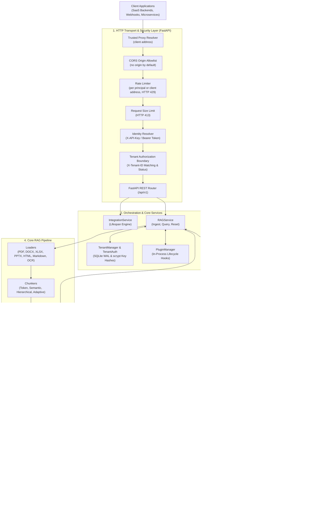

# TenantRAG

**Multi-tenant RAG infrastructure for SaaS backends.**

[](https://github.com/dibbed/tenant-rag/actions/workflows/ci.yml)
[](#-testing--verification)
[](https://www.python.org/)
[](https://fastapi.tiangolo.com/)
[](LICENSE)

TenantRAG is an API-first Python microservice providing Retrieval-Augmented Generation (RAG) designed specifically for multi-tenant SaaS architectures. It provides directory-partitioned vector stores per tenant, tenant-scoped semantic caching, API keys stored as salted scrypt hashes, and native support for local and cloud LLMs.

> [!NOTE]
> **مستندات فارسی**: مستندات کامل به زبان فارسی در فایل [README.fa.md](README.fa.md) در دسترس است.

---

## ⚡ 60-Second Quickstart

### 1. Installation & Setup

```bash
# Clone repository
git clone https://github.com/dibbed/tenant-rag.git
cd tenant-rag

# Create virtual environment and install
python -m venv venv
# On Windows: .\venv\Scripts\Activate.ps1 | On Linux/macOS: source venv/bin/activate
pip install -r requirements.txt
pip install -e .

# Configure environment
cp env.example .env
# Note: MULTI_TENANT_ENABLED=true in .env activates tenant partitioning and API key authentication.
# When disabled, API requests are rejected with HTTP 401 unless ENVIRONMENT=development and ALLOW_ANONYMOUS=true (insecure, local development only).
```

### 2. Start the Server

```bash
python main.py
# Server starts at http://localhost:8000
# Interactive OpenAPI Docs: http://localhost:8000/docs
```

### 3. Provision Tenant & API Key (CLI)

```bash
# Create tenant
tenantrag tenant create --tenant-id acme_corp --name "Acme Corporation"

# Issue an API key (stored as a salted scrypt hash; the key is shown once)
tenantrag tenant create-key --tenant-id acme_corp --name "backend_api"
# The printed key has the format rgb_<key_id>_<secret>, for example rgb_9f8a2b3c4d5e6f708192a3b4c5d6e7f8_EXAMPLE-SECRET-DO-NOT-USE-0000000000000
```

### 4. Ingest a Document (cURL)

```bash
curl -X POST "http://localhost:8000/api/v1/documents/text" \
  -H "X-Tenant-ID: acme_corp" \
  -H "X-API-Key: rgb_9f8a2b3c4d5e6f708192a3b4c5d6e7f8_EXAMPLE-SECRET-DO-NOT-USE-0000000000000" \
  -H "Content-Type: application/json" \
  -d '{
    "text": "Acme employees can expense home office equipment up to $500 annually.",
    "title": "expense_policy_2026"
  }'
```

### 5. Query with Grounded Citations (cURL)

```bash
curl -X POST "http://localhost:8000/api/v1/query" \
  -H "X-Tenant-ID: acme_corp" \
  -H "X-API-Key: rgb_9f8a2b3c4d5e6f708192a3b4c5d6e7f8_EXAMPLE-SECRET-DO-NOT-USE-0000000000000" \
  -H "Content-Type: application/json" \
  -d '{
    "question": "What is the annual home office equipment budget?",
    "language": "en"
  }'
```

**Response:**
```json
{
  "answer": "Acme employees are eligible to expense home office equipment up to $500 annually.",
  "sources": ["expense_policy_2026"],
  "confidence_score": 0.95,
  "processing_time": 0.38,
  "language": "en"
}
```

---

## 🏢 Multi-Tenancy Architecture

Unlike shared vector spaces that rely solely on metadata filters, TenantRAG enforces **siloed storage partitioning**:

```
Client Request (X-Tenant-ID: acme_corp, X-API-Key: rgb_...)
       │
       ▼
┌────────────────────────────────────────────────────────┐
│ FastAPI Gateway (Authentication & Tenant Boundary)     │
└───────────────────────────┬────────────────────────────┘
                            │
              ┌─────────────┴─────────────┐
              ▼                           ▼
    ┌──────────────────┐        ┌──────────────────┐
    │ Tenant A: Acme   │        │ Tenant B: Beta   │
    ├──────────────────┤        ├──────────────────┤
    │ • Cache A        │        │ • Cache B        │
    │ • Vector Store A │        │ • Vector Store B │
    │   data/vector_   │        │   data/vector_   │
    │   stores/acme/   │        │   stores/beta/   │
    └──────────────────┘        └──────────────────┘
```

- **Storage Partitioning:** Index files are written to dedicated tenant directories (`data/vector_stores/<tenant_id>/`). Tenant A cannot search, view, or overwrite Tenant B's vectors.
- **Tenant-Scoped Semantic Cache:** Cached query embeddings are keyed by tenant ID. Lookups evaluate cosine similarity only within the authenticated tenant's partition.
- **Authentication Separation:** Identity resolution (`X-API-Key`) is decoupled from routing (`X-Tenant-ID`). Requests attempting to access another tenant's data return `HTTP 403 Forbidden`.
- *Note:* Tenant isolation is enforced via filesystem partitioning and query filtering; it does not encrypt data at rest on disk. See [SECURITY.md](SECURITY.md).

---

## 🏛️ System Architecture



---

## ✨ Verified Capabilities

1. **Multi-Tenant by Design:** Native SQLite WAL database (`data/tenants/tenants.db`) managing tenant metadata, quotas, and API keys. Vector indices and semantic caches are physically separated per tenant.
2. **Headless FastAPI Microservice:** Designed as a standalone REST API microservice rather than a full visual AI application platform. Standard JSON schemas, automated Pydantic validation, and interactive OpenAPI documentation.
3. **Tenant-Scoped Semantic Cache:** Reuses responses for semantically similar queries by computing embedding cosine similarity within the caller's tenant partition.
4. **Vector Store Backends:** Modular vector storage supporting **FAISS** (with class-level async locks), **ChromaDB**, and **Qdrant**.
5. **LLM Provider Flexibility:** Connect to **OpenAI**, **Anthropic Claude**, **OpenRouter**, **Ollama** (offline local models), or **HuggingFace Local**.
6. **Salted scrypt API Key Hashing:** Keys (`rgb_<key_id>_<secret>`) are stored only as salted scrypt hashes and looked up by key id. Verification is constant-time (`hmac.compare_digest`). Legacy SHA-256 keys are rejected (see [SECURITY.md](SECURITY.md)).
7. **Concurrency-Hardened for Single Nodes:** `FAISSVectorStore` uses class-level `asyncio.Lock()` to prevent Windows OS file-locking collisions (`PermissionError`) during simultaneous reads and writes. SQLite uses WAL journal mode with write locks.
8. **Failure-Isolated Plugins:** In-process plugin architecture supporting lifecycle hooks (`PRE/POST_QUERY`, `PRE/POST_DOCUMENT_INGEST`, `PRE/POST_RESPONSE`). Exceptions in plugins are caught and logged without aborting client requests.
9. **Bilingual English & Persian Support:** Out-of-the-box support for Persian punctuation marks (`؟`, `؛`, `،`), numeral conversion, localized QA prompt templates, and `fas+eng` OCR defaults.
10. **Administrative CLI (`tenantrag`):** Command-line tool for tenant provisioning, key lifecycle, store migration, and benchmarking.

---

## 📡 REST API Reference

| Method | Endpoint | Description | Auth Required |
|:---|:---|:---|:---|
| `GET` | `/health` / `/api/v1/health` | System health check and component status | No |
| `POST` | `/api/v1/query` | Ask questions with grounded source citations | Yes (`X-API-Key`, `X-Tenant-ID`) |
| `POST` | `/api/v1/documents/text` | Ingest raw text directly into tenant index | Yes (`X-API-Key`, `X-Tenant-ID`) |
| `POST` | `/api/v1/documents/upload` | Upload and ingest document files (PDF, DOCX, XLSX, etc.) | Yes (`X-API-Key`, `X-Tenant-ID`) |
| `POST` | `/api/v1/documents/url` | Ingest web content from a remote URL | Yes (`X-API-Key`, `X-Tenant-ID`) |
| `POST` | `/api/v1/documents/reset` | Clear stored vectors and flush tenant cache | Yes (Admin Role Required) |

Interactive documentation is available when the server is running:
- **Swagger UI:** [http://localhost:8000/docs](http://localhost:8000/docs)
- **ReDoc:** [http://localhost:8000/redoc](http://localhost:8000/redoc)

---

## 🛠️ Administrative CLI

TenantRAG provides `tenantrag` (aliased to `ragbot-cli` for backward compatibility):

```bash
# View CLI commands
tenantrag --help

# Create a tenant
tenantrag tenant create --tenant-id org_alpha --name "Alpha Organization"

# Issue an API key
tenantrag tenant create-key --tenant-id org_alpha --name "production_key"

# List active keys
tenantrag tenant list-keys --tenant-id org_alpha

# Revoke an API key
tenantrag tenant revoke-key --tenant-id org_alpha --key-id <key_id>

# Ingest local file directly via CLI
tenantrag ingest --file handbook.pdf --tenant-id org_alpha

# Query index directly via CLI
tenantrag query --question "What is the policy?" --tenant-id org_alpha
```

---

## 📊 Reproducible Benchmarks

TenantRAG includes reproducible benchmark scripts under `benchmarks/` to measure real performance on your hardware before making quantitative claims:

```bash
# Measure semantic cache latency (cold miss vs warm hit)
python benchmarks/bench_cache.py --iterations 50

# Profile process RSS memory footprint across ingestion stages
python benchmarks/bench_memory.py --chunks 1000

# Test concurrent async operations across multiple tenants
python benchmarks/bench_concurrency.py --concurrency 10 --tenants 3 --ops 10

# Benchmark vector store indexing throughput (chunks/sec)
python benchmarks/bench_ingest.py --backend faiss --chunks 500
```

All benchmark scripts output structured JSON containing system metadata, Python version, duration, and latency percentiles.

---

## 🧪 Testing & Verification

The test suite runs with strict CPU isolation to guarantee deterministic execution without GPU dependencies:

```bash
# Windows (PowerShell):
$env:CUDA_VISIBLE_DEVICES = ""
$env:TORCH_DEVICE = "cpu"
pytest -q

# Linux / macOS:
export CUDA_VISIBLE_DEVICES=""
export TORCH_DEVICE="cpu"
pytest -q
```

**Verified Test Baseline** (Verification Pipeline, Python 3.10, 3.11 and 3.12):
```text
Tests: 1005 passed, 11 skipped, 0 failed
Security Regression Suite: 322 passed, 0 skipped, 0 failed
```

The skipped tests need an OpenAI API key or the optional chromadb package.

The Verification Pipeline (`.github/workflows/ci.yml`) runs on every pull request to `main` and every push to `main`: the full test suite, the Security Regression Suite, the Dependency Vulnerability Check, the Container Build Check and report-only Ruff, MyPy and Bandit checks. Run the same checks locally with `make verify`. See [docs/features/security-verification-pipeline/README.md](docs/features/security-verification-pipeline/README.md).

---

## 🐳 Docker Deployment

A standalone container setup is provided via `Dockerfile` and `docker-compose.yml`:

```bash
# Build and start container on port 8000
docker compose up --build -d

# Verify health endpoint
curl http://localhost:8000/api/v1/health
```

*Note:* Docker Compose binds to port `8000`. See [docs/DEPLOYMENT.md](docs/DEPLOYMENT.md) for production deployment topologies.

---

## 📚 Documentation Index

- 🛡️ [Security & Tenant Boundaries](SECURITY.md)
- 🤝 [Contributing Guidelines](CONTRIBUTING.md)
- 📖 [Architecture Deep-Dive](docs/ARCHITECTURE.md)
- 📡 [REST API Specification](docs/API.md)
- ⚙️ [Configuration Guide](docs/configuration.md)
- 🚀 [Deployment Guide](docs/DEPLOYMENT.md)
- 🗄️ [Vector Stores Reference](docs/VECTOR_STORES.md)
- 📚 [Document Format Loaders](docs/MULTI_FORMAT_SUPPORT.md)
- 💡 [API Usage Examples](docs/EXAMPLES.md)
- ❓ [Frequently Asked Questions (FAQ)](docs/FAQ.md)
- 🇮🇷 [Persian Documentation (راهنمای فارسی)](README.fa.md)
- 📜 [Changelog](CHANGELOG.md)

---

## 📄 License

MIT License © 2025–2026 TenantRAG Maintainers.
