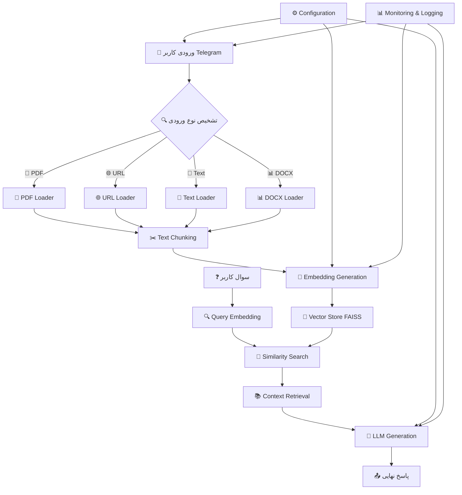
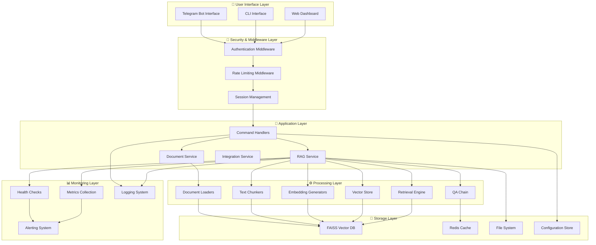
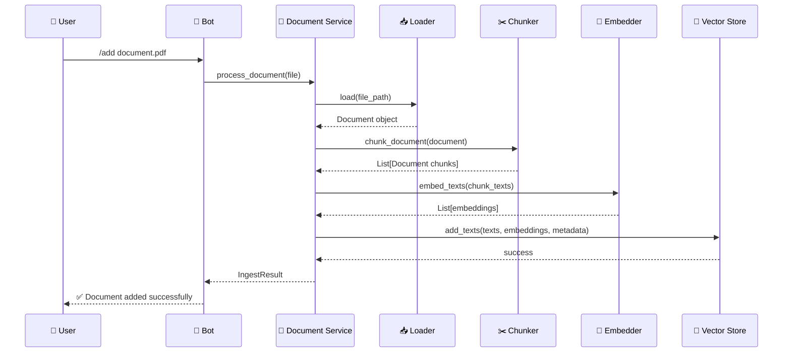
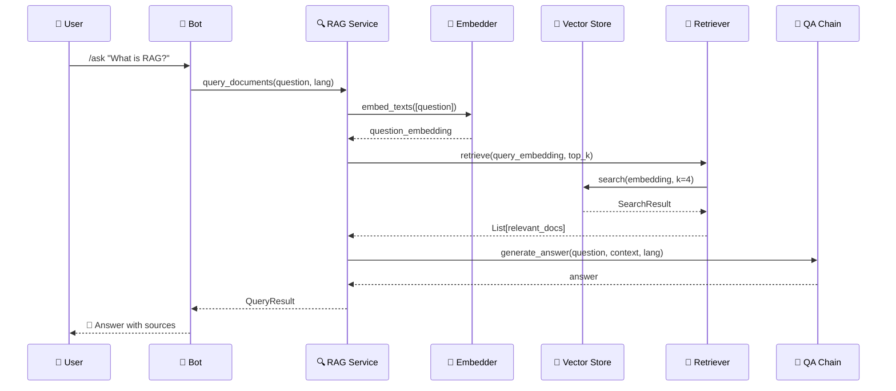
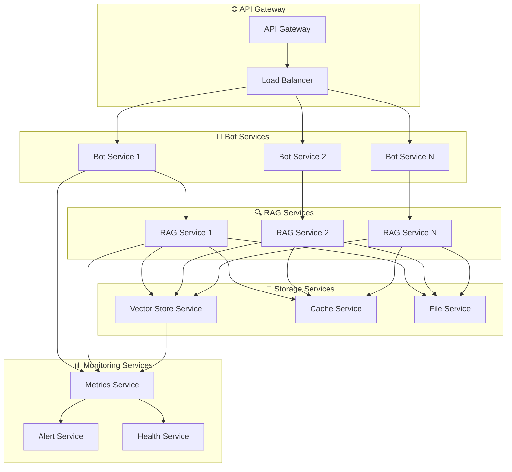
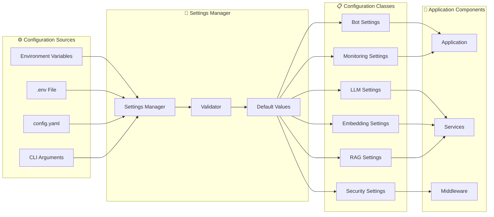
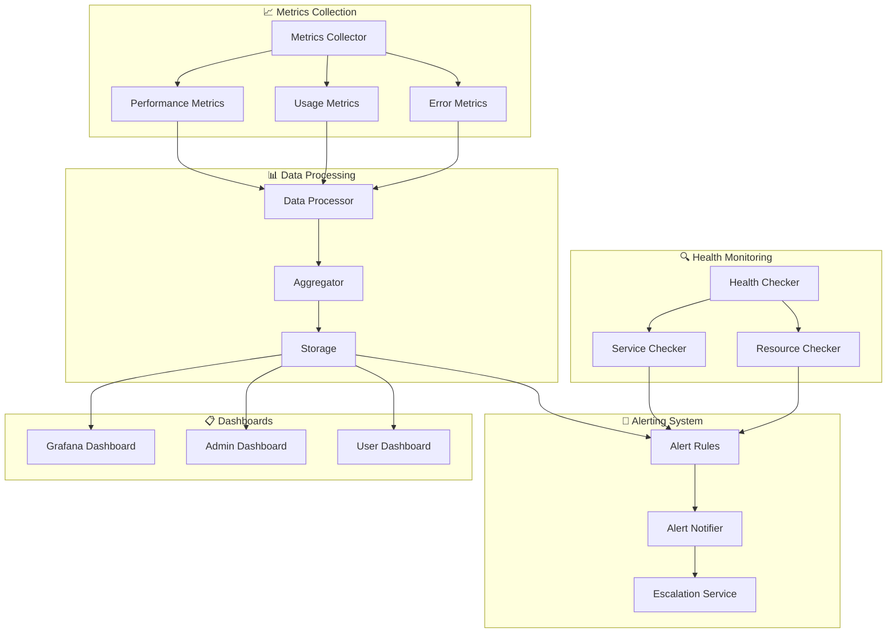

# 🏗️ نمای کلی معماری سیستم RAG Telegram Assistant

سیستم RAG Telegram Assistant یک پلتفرم پیشرفته برای پردازش اسناد و پاسخ‌دهی هوشمند است که با معماری میکروسرویس و قابلیت‌های پیشرفته پیاده‌سازی شده است.

## 🔄 جریان کلی سیستم (RAG Pipeline)



## 🏛️ معماری لایه‌ای سیستم

### 1️⃣ لایه ارتباطات (Communication Layer)

- **`app/bot.py`**: راه‌اندازی aiogram bot و dispatcher اصلی
- **`app/routes.py`**: کنترل‌کننده‌های دستورات (/ask, /add, /reset, /status, /help)
- **`app/middleware/`**:
  - `auth.py`: تصدیق کاربران و مدیریت لیست مجاز
  - `rate_limiter.py`: محدودیت نرخ درخواست‌ها
  - `session.py`: مدیریت جلسات کاربران

### 2️⃣ لایه سرویس‌ها (Services Layer)

- **`services/rag_service.py`**: هماهنگ‌کننده اصلی عملیات RAG
- **`services/document_service.py`**: مدیریت اسناد و پردازش فایل‌ها
- **`services/integration_service.py`**: یکپارچه‌سازی سرویس‌های مختلف
- **`services/graceful_degradation.py`**: مدیریت خرابی و کاهش تدریجی عملکرد

### 3️⃣ لایه پردازش داده (Data Processing Layer)

- **`rag/loaders/`**: بارگذاری داده‌ها
  - `pdf.py`: استخراج متن از فایل‌های PDF
  - `url.py`: دریافت و پردازش محتوای URL
  - `text.py`: پردازش متن خام
  - `docx.py`: استخراج متن از فایل‌های Word
- **`rag/chunkers/`**: تقسیم هوشمند متن
  - `token_chunker.py`: تقسیم بر اساس token
  - `semantic_chunker.py`: تقسیم معنایی
- **`rag/embeddings/`**: تولید جاسازی
  - `openai_embedder.py`: جاسازی OpenAI
  - `st_embedder.py`: جاسازی SentenceTransformers
  - `huggingface_embedder.py`: جاسازی HuggingFace

### 4️⃣ لایه ذخیره‌سازی (Storage Layer)

- **`rag/store/`**: مدیریت پایگاه داده برداری
  - `faiss_store.py`: پیاده‌سازی FAISS
- **`rag/retrieve/`**: واسط جستجوی تشابه
  - `retriever.py`: بازیابی اسناد مرتبط

### 5️⃣ لایه هوش مصنوعی (AI Layer)

- **`rag/qa/`**: تولید پاسخ
  - `chain.py`: زنجیره تولید پاسخ
  - `prompting.py`: مدیریت prompt‌ها

### 6️⃣ لایه پیکربندی و نظارت (Configuration & Monitoring)

- **`configs/`**: مدیریت پیکربندی
  - `settings.py`: تنظیمات جامع با Pydantic
  - `validator.py`: اعتبارسنجی تنظیمات
- **`outputs/`**: نظارت و لاگ‌گیری
  - `logger.py`: سیستم لاگ‌گیری ساختار یافته
  - `metrics.py`: متریک‌های عملکرد
  - `alerting.py`: سیستم هشدار
  - `health.py`: بررسی سلامت سیستم

### 7️⃣ لایه کش و بهینه‌سازی (Caching & Optimization)

- **`caching/`**: مدیریت کش
  - `redis_cache.py`: کش Redis
  - `memory_cache.py`: کش حافظه
  - `cache_manager.py`: مدیریت کش

### 8️⃣ لایه ابزارها (Utilities Layer)

- **`utils/`**: ابزارهای کمکی
  - `language_detector.py`: تشخیص زبان
  - `debug_helpers.py`: ابزارهای دیباگ

## 🔄 جریان داده‌های سیستم

### 📥 1. دریافت ورودی کاربر

```python
# app/routes.py
@router.message(Command("add"))
async def add_document(message: Message):
    """پردازش دستور /add برای افزودن سند"""
    # تشخیص نوع فایل (PDF, URL, Text, DOCX)
    # اعتبارسنجی کاربر
    # فراخوانی DocumentService
```

### 📄 2. بارگذاری و پردازش سند

```python
# rag/loaders/pdf.py
class PDFLoader:
    async def load(self, file_path: str) -> Document:
        """استخراج متن از فایل PDF با PyMuPDF"""
        # پردازش OCR (اختیاری)
        # استخراج متن و metadata
        # بازگرداندن Document object
```

### ✂️ 3. تقسیم متن هوشمند

```python
# rag/chunkers/token_chunker.py
class TokenChunker:
    async def chunk_document(self, document: Document) -> List[Document]:
        """تقسیم متن بر اساس token با overlap"""
        # محاسبه اندازه chunk
        # تقسیم با حفظ context
        # بازگرداندن لیست chunks
```

### 🧠 4. تولید جاسازی

```python
# rag/embeddings/openai_embedder.py
class OpenAIEmbedder:
    async def embed_texts(self, texts: List[str]) -> List[List[float]]:
        """تولید جاسازی با OpenAI API"""
        # پردازش batch
        # مدیریت rate limiting
        # بازگرداندن vectors
```

### 💾 5. ذخیره در Vector Store

```python
# rag/store/faiss_store.py
class FAISSStore:
    async def add_texts(self, texts: List[str], embeddings: List[List[float]],
                       metadata: List[Dict]) -> None:
        """ذخیره در FAISS با metadata"""
        # ساخت index
        # ذخیره embeddings
        # مدیریت metadata
```

### 🔍 6. جستجو و بازیابی

```python
# rag/retrieve/retriever.py
class Retriever:
    async def retrieve(self, query_embedding: List[float],
                     top_k: int = 4) -> SearchResult:
        """جستجوی تشابه در vector store"""
        # جستجوی FAISS
        # فیلتر بر اساس threshold
        # بازگرداندن نتایج مرتب
```

### 🤖 7. تولید پاسخ

```python
# rag/qa/chain.py
class QAChain:
    async def generate_answer(self, question: str, context: List[str],
                           language: str = "en") -> str:
        """تولید پاسخ با LLM"""
        # ساخت prompt
        # فراخوانی LLM
        # پردازش پاسخ
        # بازگرداندن نتیجه نهایی
```

## 🏗️ الگوهای طراحی پیاده‌سازی شده

### 🔧 Dependency Injection Pattern

```python
# services/rag_service.py
class RAGService:
    def __init__(
        self,
        loaders: Dict[str, DocumentLoader],
        chunker: TextChunker,
        embedder: Embedder,
        vector_store: VectorStore,
        qa_chain: QAChain,
        cache: Optional[CacheManager] = None
    ):
        """تزریق وابستگی‌ها برای انعطاف‌پذیری"""
        self.loaders = loaders
        self.chunker = chunker
        self.embedder = embedder
        self.vector_store = vector_store
        self.qa_chain = qa_chain
        self.cache = cache
```

### 🏭 Factory Pattern

```python
# configs/settings.py
class EmbedderFactory:
    @staticmethod
    def create_embedder(provider: str, **kwargs) -> Embedder:
        """ایجاد embedder بر اساس provider"""
        if provider == "openai":
            return OpenAIEmbedder(**kwargs)
        elif provider == "sentence_transformers":
            return STEmbedder(**kwargs)
        elif provider == "huggingface":
            return HuggingFaceEmbedder(**kwargs)
        else:
            raise ValueError(f"Unknown provider: {provider}")
```

### 📚 Repository Pattern

```python
# rag/store/base.py
class VectorStoreRepository:
    async def save_documents(self, documents: List[Document]) -> None:
        """ذخیره اسناد در repository"""

    async def search_similar(self, query: str, k: int) -> List[Document]:
        """جستجوی اسناد مشابه"""

    async def get_count(self) -> int:
        """تعداد اسناد موجود"""
```

### 🎯 Strategy Pattern

```python
# rag/chunkers/base.py
class ChunkingStrategy:
    async def chunk_document(self, document: Document) -> List[Document]:
        """استراتژی تقسیم متن"""
        pass

class TokenChunker(ChunkingStrategy):
    """تقسیم بر اساس token"""

class SemanticChunker(ChunkingStrategy):
    """تقسیم معنایی"""
```

## ⚙️ پیکربندی سیستم

### 🔧 تنظیمات اصلی

```python
# configs/settings.py
class Settings:
    # Telegram Bot
    bot_token: str
    allow_users: str

    # LLM Configuration
    llm_provider: Literal["openai", "anthropic", "ollama", "openrouter", "hf_local"]
    llm_model: str
    llm_temperature: float

    # Embedding Configuration
    embed_provider: Literal["openai", "huggingface", "sentence_transformers"]
    embed_model: str

    # RAG Configuration
    chunk_size: int = 512
    chunk_overlap: int = 50
    top_k: int = 4
    similarity_threshold: float = 0.7

    # Security & Performance
    max_file_size_mb: int = 50
    rate_limit_requests: int = 10
    cache_ttl: int = 3600
```

## 📊 نظارت و مانیتورینگ

### 📈 متریک‌های عملکرد

- **Document Processing**: زمان پردازش، تعداد chunks تولید شده
- **Query Performance**: زمان پاسخ، تعداد نتایج بازیابی شده
- **System Health**: وضعیت کامپوننت‌ها، خطاها
- **User Activity**: تعداد درخواست‌ها، کاربران فعال

### 🚨 سیستم هشدار

- **Error Thresholds**: هشدار در صورت افزایش خطاها
- **Performance Degradation**: کاهش عملکرد سیستم
- **Resource Usage**: مصرف حافظه و CPU
- **API Limits**: نزدیک شدن به محدودیت‌های API

## 🚀 مزایای معماری سیستم

### 🧩 مدولاریت (Modularity)

- **جداسازی مسئولیت‌ها**: هر کامپوننت وظیفه مشخصی دارد
- **تست مستقل**: امکان تست هر بخش به صورت جداگانه
- **جایگزینی آسان**: قابلیت تعویض کامپوننت‌ها بدون تأثیر بر سایر بخش‌ها
- **کد تمیز**: ساختار منظم و قابل فهم

### 📈 مقیاس‌پذیری (Scalability)

- **اجرای موازی**: پردازش همزمان چندین درخواست
- **Load Balancing**: توزیع بار بر روی چندین سرور
- **Horizontal Scaling**: امکان اضافه کردن سرورهای جدید
- **Resource Optimization**: بهینه‌سازی مصرف منابع

### 🔧 قابلیت نگهداری (Maintainability)

- **کد تمیز و خوانا**: ساختار منظم و مستندات کامل
- **تست‌های جامع**: پوشش کامل تست‌های unit، integration و e2e
- **Error Handling**: مدیریت جامع خطاها و exception‌ها
- **Logging**: سیستم لاگ‌گیری ساختار یافته

### 🔄 انعطاف‌پذیری (Flexibility)

- **پشتیبانی از مدل‌های مختلف**: OpenAI، HuggingFace، SentenceTransformers
- **فرمت‌های متنوع**: PDF، DOCX، URL، Text
- **پیکربندی آسان**: تنظیمات از طریق environment variables
- **Plugin Architecture**: امکان اضافه کردن قابلیت‌های جدید

## 🛡️ امنیت و قابلیت اطمینان

### 🔐 امنیت

- **User Authentication**: تصدیق کاربران و لیست مجاز
- **Rate Limiting**: محدودیت نرخ درخواست‌ها
- **File Validation**: اعتبارسنجی فایل‌های ورودی
- **Input Sanitization**: پاکسازی ورودی‌های کاربر

### 🛠️ قابلیت اطمینان

- **Graceful Degradation**: کاهش تدریجی عملکرد در صورت خرابی
- **Health Monitoring**: نظارت مداوم بر سلامت سیستم
- **Error Recovery**: بازیابی خودکار از خطاها
- **Backup & Recovery**: پشتیبان‌گیری و بازیابی داده‌ها

## 📊 عملکرد و بهینه‌سازی

### ⚡ بهینه‌سازی عملکرد

- **Caching Strategy**: کش Redis و حافظه برای بهبود سرعت
- **Batch Processing**: پردازش دسته‌ای برای کاهش overhead
- **Async Operations**: عملیات غیرهمزمان برای بهبود throughput
- **Resource Pooling**: مدیریت pool اتصالات

### 📈 مانیتورینگ عملکرد

- **Real-time Metrics**: متریک‌های زمان واقعی
- **Performance Profiling**: تحلیل عملکرد سیستم
- **Resource Monitoring**: نظارت بر مصرف منابع
- **Alert System**: سیستم هشدار برای مشکلات

## 🔮 قابلیت‌های آینده

### 🌟 توسعه‌های پیشنهادی

- **Multi-language Support**: پشتیبانی از زبان‌های بیشتر
- **Advanced OCR**: OCR پیشرفته برای تصاویر
- **Voice Integration**: یکپارچگی با سیستم‌های صوتی
- **Real-time Collaboration**: همکاری زمان واقعی

### 🚀 بهبودهای فنی

- **Microservices Architecture**: معماری میکروسرویس کامل
- **Container Orchestration**: مدیریت کانتینرها با Kubernetes
- **Advanced Caching**: کش پیشرفته با Redis Cluster
- **ML Pipeline**: خط لوله یادگیری ماشین برای بهبود مدل‌ها

## 📊 نمودارهای تفصیلی سیستم

### 🏗️ نمودار معماری کلی سیستم



### 🔄 نمودار جریان پردازش سند



### 🔍 نمودار جریان پرسش و پاسخ



### 🏛️ نمودار معماری میکروسرویس



### 🔧 نمودار پیکربندی سیستم



### 📊 نمودار نظارت و مانیتورینگ


