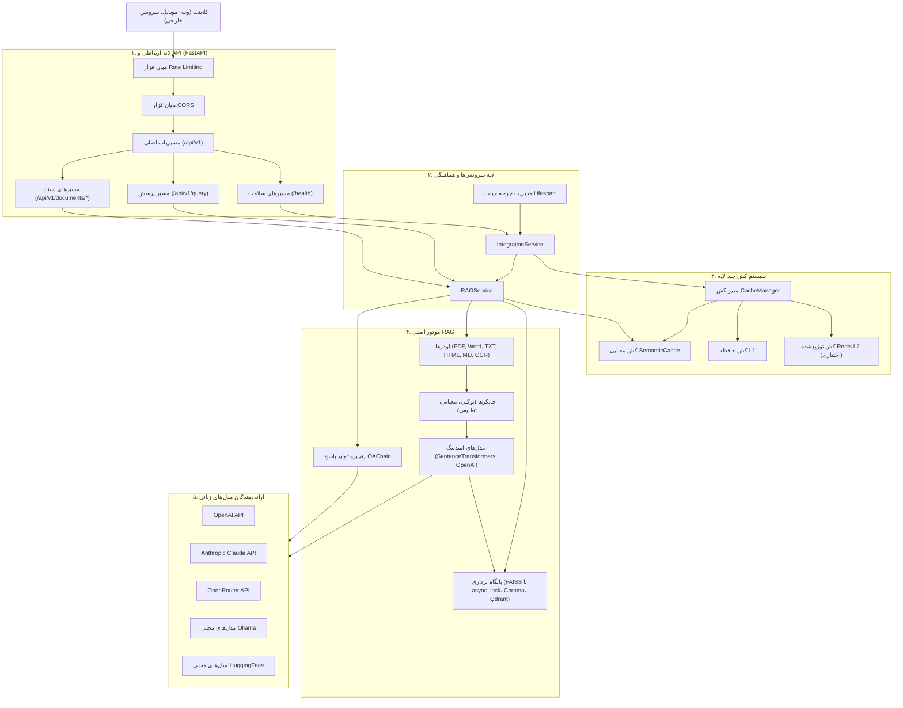

# 🏗️ معماری سیستم RAGBot

سیستم RAGBot یک پلتفرم بک‌اند مدرن و مبتنی بر **FastAPI** برای تولید پاسخ با بازیابی اطلاعات (RAG) است که برای عملکرد بالا، مقیاس‌پذیری و دقت در بازیابی اسناد طراحی شده است.

---

## 🔄 نمای کلی جریان داده‌ها

---

## 🏛️ تشریح لایه‌های معماری

### ۱. لایه انتقال و ارتباطی (`ragbot/api/`)
- **فریم‌ورک FastAPI**: فریم‌ورک ناهمگام (async) برای ارائه مسیرهای RESTful به همراه اعتبارسنجی خودکار Pydantic و مستندات تعاملی Swagger.
- **چرخه حیات (Lifespan Context)**: بارگذاری اولیه و یکباره سرویس‌های سنگین (`IntegrationService`، مدل‌های امبدینگ و پایگاه داده برداری) در زمان استارت سرور، اتصال آن‌ها به `app.state` و آزادسازی منابع هنگام خاموش شدن.
- **میان‌افزار محدودسازی درخواست (`RateLimitMiddleware`)**: شمارنده لغزان بر پایه زمان به ازای هر IP برای جلوگیری از حملات منع سرویس (DoS).

### ۲. لایه سرویس‌ها (`ragbot/services/`)
- **`IntegrationService`**: هماهنگ‌کننده کلان اجزا، بررسی سلامت سیستم (`health_check`)، ردیابی رفتارهای کاربران و تخریب تدریجی مطمئن (Graceful Degradation).
- **`RAGService`**: هدایت‌کننده خطوط پردازش اسناد (بارگذاری، استخراج متن، امبدینگ، ذخیره‌سازی) و اجرای جستجوی معنایی و تجمیع پاسخ‌ها. همچنین این سرویس بازنشانی اتمیک مخزن برداری و کش‌ها را مدیریت می‌کند.

### ۳. لایه کش معنایی و عمومی (`ragbot/caching/`)
- **`SemanticCache`**: بررسی شباهت کسینوسی امبدینگ سوال با پرسش‌های قبلی. اگر شباهت از آستانه معین بیشتر باشد، پاسخ بلافاصله از کش بازگردانده شده و نیازی به فراخوانی مجدد LLM نیست.
- **`CacheManager`**: مدیریت کش دوسطحی در حافظه و Redis برای ذخیره امبدینگ‌ها و متادیتا.

### ۴. موتور هسته RAG (`ragbot/rag/`)
- **بارگذارها (Loaders)**: استخراج بهینه متن از انواع قالب‌ها (PDF از طریق PyMuPDF، صفحات وب HTML با حفظ ساختار تیترها، فایل‌های Word، اکسل و OCR).
- **خردسازها (Chunkers)**: تقسیم هوشمند متن با متدهای توکنی، معنایی و تطبیقی همراه با حفظ متادیتای صفحات.
- **پایگاه‌های برداری (Vector Stores)**:
  - `FAISSVectorStore`: ذخیره و جستجوی پرسرعت بردارها، مجهز به قفل ناهمگام `async_lock` جهت جلوگیری از تداخل عملیات نوشتن و خطای اشتراک فایل در ویندوز.
  - پشتیبانی از Chroma، Qdrant و Weaviate.
- **زنجیره پاسخ‌دهی (`QAChain`)**: ساخت پرامپت با قالب‌های استاندارد دوزبانه و فراخوانی API مدل‌های زبانی (OpenAI, Anthropic Claude, OpenRouter, Ollama).

---

## 🏢 زیرسیستم چندمستأجری (`ragbot/multi_tenant/`)

سیستم RAGBot دارای معماری پیشرفته چندمستأجری (Multi-Tenancy) سازمانی با ایزولاسیون سخت‌گیرانه داده‌ها و منابع است:

### ذخیره‌سازی پایدار در SQLite
- **پایگاه داده**: کتابخانه استاندارد `sqlite3` بدون وابستگی به ORMهای سنگین خارجی در مسیر `data/tenants/tenants.db`.
- **همزمانی**: مدیریت همزمانی با حالت WAL و قفل ناهمگام `asyncio.Lock()` جهت اجرای اتمیک تراکنش‌ها.
- **پیش‌بارگذاری در حافظه**: بارگذاری اولیه تنظیمات مستأجرها، سهمیه‌ها و کاربران در حافظه موقت هنگام راه‌اندازی سرور جهت افزایش چشمگیر سرعت پاسخ‌دهی.

### اصول ایزولاسیون داده‌ها
1. **ایزولاسیون مخزن برداری**:
   - در **FAISS** از طریق دایرکتوری‌های مجزا به ازای هر مستأجر (`data/vector_store/tenants/<tenant_id>`).
   - در **Chroma و Qdrant** از طریق کالکشن‌های اختصاصی تفکیک‌شده (`tenant_<tenant_id>`).
2. **ایزولاسیون کش معنایی**:
   - کلیدهای کش با شناسه مستأجر پیشوندگذاری می‌شوند (`{tenant_id}:{query_hash}`).
   - جستجوی شباهت کسینوسی صرفاً میان رکوردهای همان مستأجر انجام می‌شود.
   - پاک‌سازی کش یک مستأجر هیچ تأثیری بر کش سایر مستأجرها ندارد.
3. **بازنشانی امن مخزن**:
   - بازنشانی مستأجر در `/api/v1/documents/reset` با هدر `X-Tenant-ID: <id>` فقط داده‌ها و کش همان مستأجر را پاک‌سازی می‌کند.
   - اجرای بازنشانی مستلزم احراز هویت با نقش مدیر (`admin` یا `super_admin`) است.

---

## 🛡️ مدل امنیت و احراز هویت رمزنگاری‌شده

- **تفکیک هویت از مسیریابی**:
  - احراز هویت هویت کلاینت صرفاً از طریق کلید API معتبر در هدر `X-API-Key: rgb_<token>` یا توکن نشست در `Authorization: Bearer <token>` انجام می‌شود.
  - هدر `X-Tenant-ID` تنها نقش تعیین بافت و زمینه مسیریابی را دارد. کلاینت اجازه جعل یا انتخاب شناسه مستأجر دیگر را ندارد و تلاش برای دسترسی ضربدری با خطای `HTTP 403 Forbidden` مواجه می‌شود.
  - عدم ارسال مدارک هویتی در حالت چندمستأجری منجر به خطای `HTTP 401 Unauthorized` می‌گردد.
- **ذخیره انحصاری هش‌های رمزنگاری‌شده**:
  - کلیدهای خام با قالب `rgb_<token>` تولید شده و تنها یک‌بار در زمان صدور نمایش داده می‌شوند.
  - در پایگاه داده SQLite، تنها هش SHA-256 ذخیره می‌گردد و پیشوند ۱۲ کاراکتری کلید برای نمایش در لیست‌ها استفاده می‌شود.
  - لغو کلید بلافاصله پایگاه داده و کش درون‌حافظه‌ای را نامعتبر می‌سازد.
- **سازگاری کامل با حالت تک‌مستأجری**:
  - در صورت غیرفعال بودن چندمستأجری (`MULTI_TENANT_ENABLED=false`)، تمام درخواست‌ها بدون نیاز به هدرهای احراز هویت یا شناسه مستأجر مانند گذشته پردازش می‌شوند.

---

## 🔌 زیرسیستم افزونه‌ها (`ragbot/plugins/`)

معماری افزونه‌های درون‌پردازشی و مطمئن جهت گسترش رفتارهای خط لوله RAG بدون دستکاری در کدهای پایه:

### چرخه حیات و بارگذاری
- **کشف خودکار**: پایش دایرکتوری افزونه‌ها (`plugins/`) و بارگذاری ماژول‌های معتبر هنگام شروع به کار سرور.
- **مدیریت پویا**: امکان بارگذاری، بارگذاری مجدد و حذف افزونه‌ها در زمان اجرا از طریق واسط خط فرمان (`ragbot-cli plugin`).

### ایزولاسیون کامل خطاها (Failure Boundary)
- افزونه‌ها کدهای خود را به هوک‌های استاندارد متصل می‌کنند:
  - `PRE_DOCUMENT_INGEST` و `POST_DOCUMENT_INGEST`
  - `PRE_QUERY` و `POST_QUERY`
  - `PRE_RESPONSE` و `POST_RESPONSE`
- **مرز ایزولاسیون**: هرگونه خطای داخلی در افزونه‌ها مهار شده و در قالب هشدار لاگ می‌گردد؛ افزونه خراب هرگز نمی‌تواند درخواست کلاینت یا هسته سرور را دچار اختلال کند.

