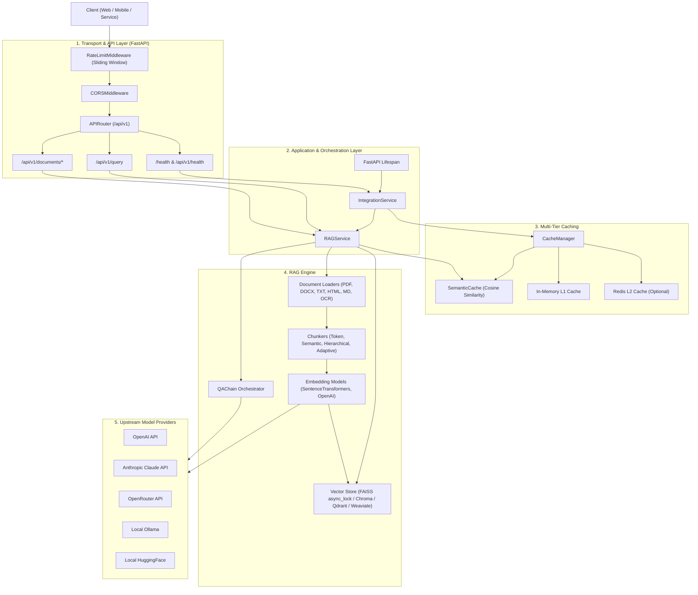

# 🏗️ RAGBot System Architecture

RAGBot is an API-first Retrieval-Augmented Generation (RAG) platform architected for high-performance document ingestion, semantic search, and context-aware answer generation.

---

## 🔄 End-to-End System Overview



---

## 🏛️ Layered Architectural Breakdown

### 1️⃣ Transport & API Layer (`ragbot/api/`)
- **FastAPI Application**: High-speed asynchronous web framework hosting typed REST endpoints with automatic OpenAPI documentation.
- **Lifespan Context (`ragbot/api/app.py`)**: Asynchronously initializes shared system components once on startup (`IntegrationService`, `QAChain`, vector stores, and embedders), attaches them to `app.state`, and cleanly frees resources on shutdown.
- **Rate Limiting Middleware (`ragbot/api/middleware/rate_limit.py`)**: Protects the API using a thread-safe sliding-window timestamp counter per client IP address.
- **Exception Shielding**: Converts unhandled system exceptions into clean JSON problem responses to prevent leaking internal tracebacks or secrets.

### 2️⃣ Service Orchestration Layer (`ragbot/services/`)
- **`IntegrationService` (`ragbot/services/integration_service.py`)**: Acts as the central system coordinator. Manages component lifecycles, health assessments, performance telemetry, and graceful degradation when optional subsystems (e.g. Redis) are unreachable.
- **`RAGService` (`ragbot/services/rag_service.py`)**: Drives core RAG workflows:
  - Validates document inputs and handles temporary staging.
  - Coordinates chunking, metadata extraction, embedding, and vector storage.
  - Executes hybrid semantic queries, context assembling, and LLM prompt generation.
  - Manages atomic knowledge base resets across vector storage and all cache tiers.

### 3️⃣ Multi-Tier Caching System (`ragbot/caching/`)
- **`SemanticCache` (`ragbot/caching/semantic_cache.py`)**: Indexes prior query embeddings. If an incoming query has a cosine similarity exceeding the threshold (e.g. `0.85`), the cached answer is returned immediately, bypassing vector search and LLM invocation.
- **`CacheManager` (`ragbot/caching/cache_manager.py`)**: Coordinates L1 in-memory LRU cache and optional L2 Redis distributed cache for embedding vectors and document metadata.

### 4️⃣ RAG Core Engine (`ragbot/rag/`)
- **Document Loaders (`ragbot/rag/loaders/`)**:
  - `PDFLoader`: High-performance text and structural extraction via PyMuPDF.
  - `HTMLLoader` & `URLLoader`: Asynchronous web page fetching, HTML stripping, heading hierarchy preservation, and link extraction.
  - `DOCXLoader`, `PPTXLoader`, `XLSXLoader`, `TextLoader`, `MarkdownLoader`.
  - `OCRLoader`: Optical character recognition fallback for scanned images and image-based PDFs (`pytesseract`, `easyocr`).
- **Text Chunkers (`ragbot/rag/chunkers/`)**:
  - Token-based chunking with configurable overlap.
  - Semantic sentence-boundary chunking.
  - Hierarchical and adaptive chunking with `ChunkOptimizer`.
- **Vector Storage (`ragbot/rag/store/`)**:
  - `FAISSVectorStore`: High-speed local index. Concurrency-safe via class-level `async_lock`, preventing race conditions during index mutation and file replace operations.
  - `ChromaVectorStore`: Embedded metadata-filtered vector storage.
  - `QdrantVectorStore`: Scalable vector database with payload indexing.
  - `WeaviateVectorStore`: Enterprise GraphQL-based vector database.
- **QA Chain (`ragbot/rag/qa/chain.py`)**:
  - Contextual prompt assembly with Persian and English language templates.
  - Multi-provider support: OpenAI, Anthropic Claude (Messages API), OpenRouter, Ollama, and local HuggingFace Transformers.

---

## 🔄 Core Request Pipelines

### Document Ingestion Flow
```text
POST /api/v1/documents/upload (or /text, /url)
  ↓
1. Validate format & enforce size limits (HTTP 413 / 415 check)
  ↓
2. Sanitize filename & extract text via appropriate Loader
  ↓
3. Split text into chunks with metadata (source, span, page)
  ↓
4. Generate vector embeddings (batch inference)
  ↓
5. Acquire VectorStore async_lock & insert vectors + documents
  ↓
6. Atomically persist index to disk & clean up temporary files
  ↓
Return IngestResponse (chunks created, processing time)
```

### RAG Query Flow
```text
POST /api/v1/query
  ↓
1. RateLimitMiddleware checks client IP sliding-window quota
  ↓
2. Generate query embedding via configured Embedder
  ↓
3. Check SemanticCache for high-similarity match
     ├── Match found (score >= threshold) ──> Return cached answer
     └── Cache miss ──> Continue
  ↓
4. Execute vector similarity search on VectorStore (top_k chunks)
  ↓
5. Assemble context chunks into language-specific prompt template
  ↓
6. Call LLM provider (OpenAI / Anthropic / OpenRouter / Ollama)
  ↓
7. Calculate confidence score and source citations
  ↓
8. Write confident response to SemanticCache
  ↓
Return QueryResponse
```
