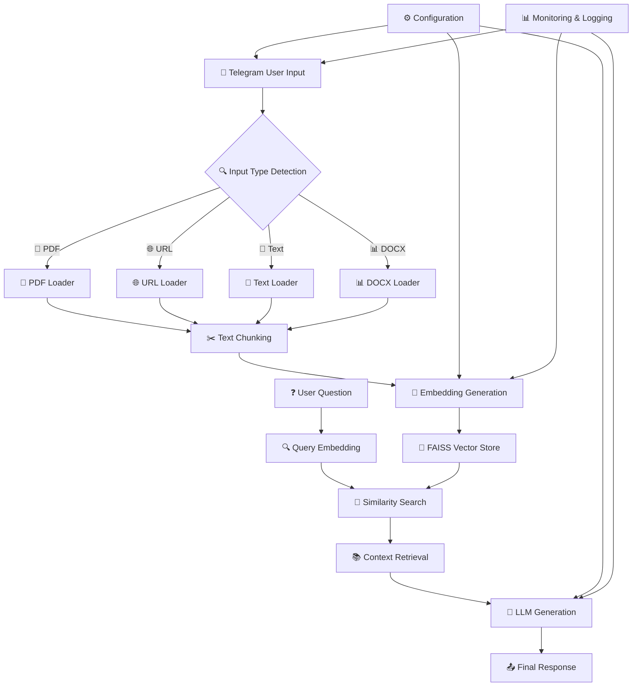
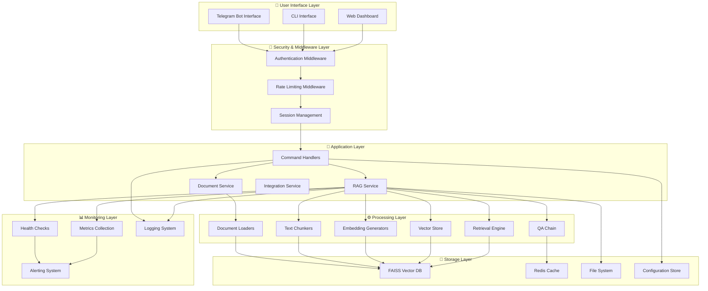
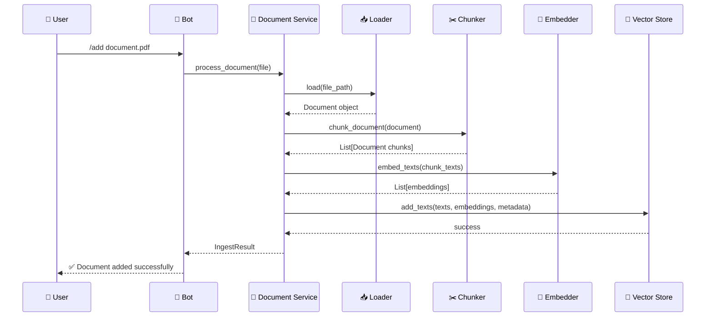
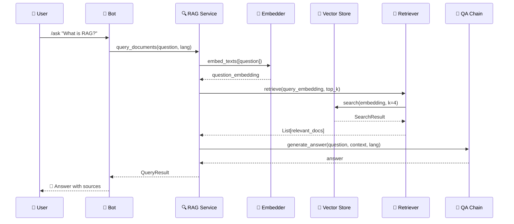
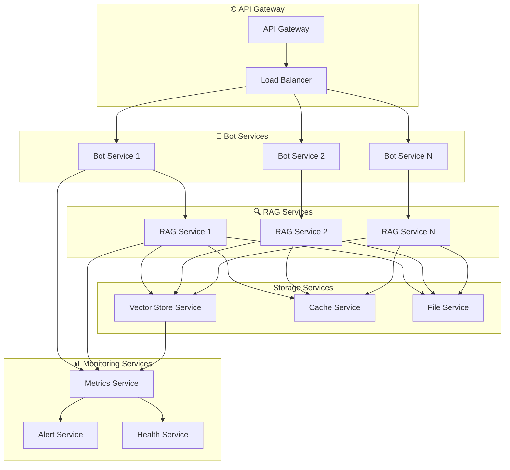
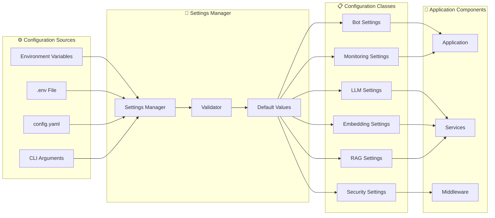
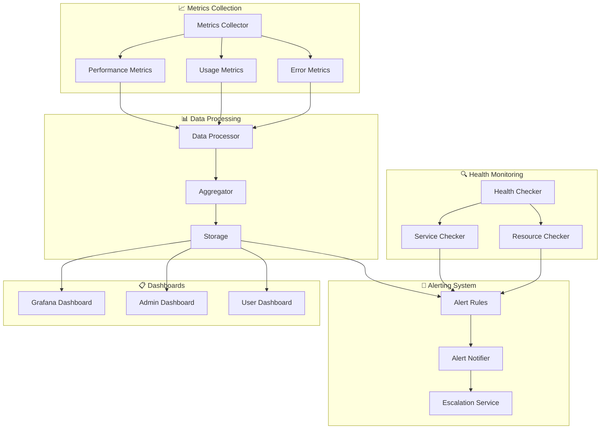

# 🏗️ RAG Telegram Assistant System Architecture

The RAG Telegram Assistant is an advanced platform for document processing and intelligent response generation, implemented with microservices architecture and advanced capabilities.

## 🔄 System Overview (RAG Pipeline)



## 🏛️ Layered System Architecture

### 1️⃣ Communication Layer

- **`app/bot.py`**: Main aiogram bot and dispatcher setup
- **`app/routes.py`**: Command handlers (/ask, /add, /reset, /status, /help)
- **`app/middleware/`**:
  - `auth.py`: User authentication and allowlist management
  - `rate_limiter.py`: Request rate limiting
  - `session.py`: User session management

### 2️⃣ Services Layer

- **`services/rag_service.py`**: Main RAG operations orchestrator
- **`services/document_service.py`**: Document management and file processing
- **`services/integration_service.py`**: Integration of various services
- **`services/graceful_degradation.py`**: Failure handling and graceful degradation

### 3️⃣ Data Processing Layer

- **`rag/loaders/`**: Data loading
  - `pdf.py`: Text extraction from PDF files
  - `url.py`: URL content fetching and processing
  - `text.py`: Raw text processing
  - `docx.py`: Word document text extraction
- **`rag/chunkers/`**: Intelligent text chunking
  - `token_chunker.py`: Token-based chunking
  - `semantic_chunker.py`: Semantic chunking
- **`rag/embeddings/`**: Embedding generation
  - `openai_embedder.py`: OpenAI embeddings
  - `st_embedder.py`: SentenceTransformers embeddings
  - `huggingface_embedder.py`: HuggingFace embeddings

### 4️⃣ Storage Layer

- **`rag/store/`**: Vector database management
  - `faiss_store.py`: FAISS implementation
- **`rag/retrieve/`**: Similarity search interface
  - `retriever.py`: Relevant document retrieval

### 5️⃣ AI Layer

- **`rag/qa/`**: Response generation
  - `chain.py`: Response generation chain
  - `prompting.py`: Prompt management

### 6️⃣ Configuration & Monitoring Layer

- **`configs/`**: Configuration management
  - `settings.py`: Comprehensive settings with Pydantic
  - `validator.py`: Settings validation
- **`outputs/`**: Monitoring and logging
  - `logger.py`: Structured logging system
  - `metrics.py`: Performance metrics
  - `alerting.py`: Alert system
  - `health.py`: System health checks

### 7️⃣ Caching & Optimization Layer

- **`caching/`**: Cache management
  - `redis_cache.py`: Redis cache
  - `memory_cache.py`: Memory cache
  - `cache_manager.py`: Cache management

### 8️⃣ Utilities Layer

- **`utils/`**: Helper utilities
  - `language_detector.py`: Language detection
  - `debug_helpers.py`: Debug utilities

## 🔄 System Data Flow

### 📥 1. User Input Reception

```python
# app/routes.py
@router.message(Command("add"))
async def add_document(message: Message):
    """Process /add command for document addition"""
    # File type detection (PDF, URL, Text, DOCX)
    # User validation
    # DocumentService call
```

### 📄 2. Document Loading and Processing

```python
# rag/loaders/pdf.py
class PDFLoader:
    async def load(self, file_path: str) -> Document:
        """Extract text from PDF file using PyMuPDF"""
        # OCR processing (optional)
        # Text and metadata extraction
        # Return Document object
```

### ✂️ 3. Intelligent Text Chunking

```python
# rag/chunkers/token_chunker.py
class TokenChunker:
    async def chunk_document(self, document: Document) -> List[Document]:
        """Token-based text chunking with overlap"""
        # Chunk size calculation
        # Context-preserving splitting
        # Return chunk list
```

### 🧠 4. Embedding Generation

```python
# rag/embeddings/openai_embedder.py
class OpenAIEmbedder:
    async def embed_texts(self, texts: List[str]) -> List[List[float]]:
        """Generate embeddings using OpenAI API"""
        # Batch processing
        # Rate limiting management
        # Return vectors
```

### 💾 5. Vector Store Storage

```python
# rag/store/faiss_store.py
class FAISSStore:
    async def add_texts(self, texts: List[str], embeddings: List[List[float]],
                       metadata: List[Dict]) -> None:
        """Store in FAISS with metadata"""
        # Index creation
        # Embedding storage
        # Metadata management
```

### 🔍 6. Search and Retrieval

```python
# rag/retrieve/retriever.py
class Retriever:
    async def retrieve(self, query_embedding: List[float],
                     top_k: int = 4) -> SearchResult:
        """Similarity search in vector store"""
        # FAISS search
        # Threshold filtering
        # Return ranked results
```

### 🤖 7. Response Generation

```python
# rag/qa/chain.py
class QAChain:
    async def generate_answer(self, question: str, context: List[str],
                           language: str = "en") -> str:
        """Generate response using LLM"""
        # Prompt construction
        # LLM call
        # Response processing
        # Return final result
```

## 🏗️ Implemented Design Patterns

### 🔧 Dependency Injection Pattern

```python
# services/rag_service.py
class RAGService:
    def __init__(
        self,
        loaders: Dict[str, DocumentLoader],
        chunker: TextChunker,
        embedder: Embedder,
        vector_store: VectorStore,
        qa_chain: QAChain,
        cache: Optional[CacheManager] = None
    ):
        """Dependency injection for flexibility"""
        self.loaders = loaders
        self.chunker = chunker
        self.embedder = embedder
        self.vector_store = vector_store
        self.qa_chain = qa_chain
        self.cache = cache
```

### 🏭 Factory Pattern

```python
# configs/settings.py
class EmbedderFactory:
    @staticmethod
    def create_embedder(provider: str, **kwargs) -> Embedder:
        """Create embedder based on provider"""
        if provider == "openai":
            return OpenAIEmbedder(**kwargs)
        elif provider == "sentence_transformers":
            return STEmbedder(**kwargs)
        elif provider == "huggingface":
            return HuggingFaceEmbedder(**kwargs)
        else:
            raise ValueError(f"Unknown provider: {provider}")
```

### 📚 Repository Pattern

```python
# rag/store/base.py
class VectorStoreRepository:
    async def save_documents(self, documents: List[Document]) -> None:
        """Save documents to repository"""

    async def search_similar(self, query: str, k: int) -> List[Document]:
        """Search for similar documents"""

    async def get_count(self) -> int:
        """Get document count"""
```

### 🎯 Strategy Pattern

```python
# rag/chunkers/base.py
class ChunkingStrategy:
    async def chunk_document(self, document: Document) -> List[Document]:
        """Text chunking strategy"""
        pass

class TokenChunker(ChunkingStrategy):
    """Token-based chunking"""

class SemanticChunker(ChunkingStrategy):
    """Semantic chunking"""
```

## ⚙️ System Configuration

### 🔧 Main Settings

```python
# configs/settings.py
class Settings:
    # Telegram Bot
    bot_token: str
    allow_users: str

    # LLM Configuration
    llm_provider: Literal["openai", "anthropic", "ollama", "openrouter", "hf_local"]
    llm_model: str
    llm_temperature: float

    # Embedding Configuration
    embed_provider: Literal["openai", "huggingface", "sentence_transformers"]
    embed_model: str

    # RAG Configuration
    chunk_size: int = 512
    chunk_overlap: int = 50
    top_k: int = 4
    similarity_threshold: float = 0.7

    # Security & Performance
    max_file_size_mb: int = 50
    rate_limit_requests: int = 10
    cache_ttl: int = 3600
```

## 📊 Monitoring and Observability

### 📈 Performance Metrics

- **Document Processing**: Processing time, chunks generated
- **Query Performance**: Response time, retrieved results count
- **System Health**: Component status, errors
- **User Activity**: Request count, active users

### 🚨 Alert System

- **Error Thresholds**: Alerts for increased error rates
- **Performance Degradation**: System performance decline
- **Resource Usage**: Memory and CPU consumption
- **API Limits**: Approaching API rate limits

## 🚀 System Architecture Benefits

### 🧩 Modularity

- **Separation of Concerns**: Each component has a specific responsibility
- **Independent Testing**: Ability to test each section separately
- **Easy Replacement**: Ability to replace components without affecting others
- **Clean Code**: Organized and understandable structure

### 📈 Scalability

- **Parallel Execution**: Simultaneous processing of multiple requests
- **Load Balancing**: Distribution of load across multiple servers
- **Horizontal Scaling**: Ability to add new servers
- **Resource Optimization**: Resource consumption optimization

### 🔧 Maintainability

- **Clean and Readable Code**: Organized structure and complete documentation
- **Comprehensive Tests**: Full coverage of unit, integration, and e2e tests
- **Error Handling**: Comprehensive error and exception management
- **Logging**: Structured logging system

### 🔄 Flexibility

- **Multiple Model Support**: OpenAI, HuggingFace, SentenceTransformers
- **Various Formats**: PDF, DOCX, URL, Text
- **Easy Configuration**: Settings through environment variables
- **Plugin Architecture**: Ability to add new features

## 🛡️ Security and Reliability

### 🔐 Security

- **User Authentication**: User verification and allowlist
- **Rate Limiting**: Request rate limitations
- **File Validation**: Input file validation
- **Input Sanitization**: User input sanitization

### 🛠️ Reliability

- **Graceful Degradation**: Gradual performance reduction in case of failure
- **Health Monitoring**: Continuous system health monitoring
- **Error Recovery**: Automatic error recovery
- **Backup & Recovery**: Data backup and recovery

## 📊 Performance and Optimization

### ⚡ Performance Optimization

- **Caching Strategy**: Redis and memory cache for speed improvement
- **Batch Processing**: Batch processing to reduce overhead
- **Async Operations**: Asynchronous operations for improved throughput
- **Resource Pooling**: Connection pool management

### 📈 Performance Monitoring

- **Real-time Metrics**: Real-time metrics
- **Performance Profiling**: System performance analysis
- **Resource Monitoring**: Resource consumption monitoring
- **Alert System**: Alert system for issues

## 🔮 Future Capabilities

### 🌟 Proposed Developments

- **Multi-language Support**: Support for more languages
- **Advanced OCR**: Advanced OCR for images
- **Voice Integration**: Integration with voice systems
- **Real-time Collaboration**: Real-time collaboration

### 🚀 Technical Improvements

- **Microservices Architecture**: Complete microservices architecture
- **Container Orchestration**: Container management with Kubernetes
- **Advanced Caching**: Advanced caching with Redis Cluster
- **ML Pipeline**: Machine learning pipeline for model improvement

## 📊 Detailed System Diagrams

### 🏗️ Overall System Architecture Diagram



### 🔄 Document Processing Flow Diagram



### 🔍 Query and Answer Flow Diagram



### 🏛️ Microservices Architecture Diagram



### 🔧 System Configuration Diagram



### 📊 Monitoring and Observability Diagram


